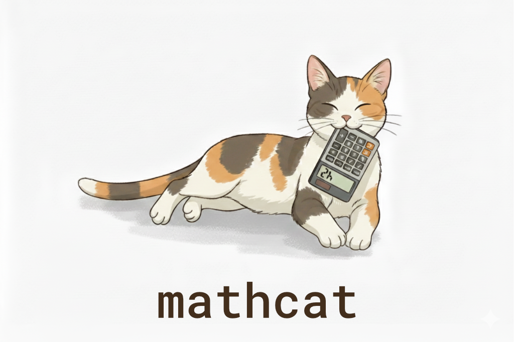

```sh
> npm install maaths
```

# maaths

maaths is a collection of math helpers for 3D graphics and simulations.

**Features:**

- Vector, Quaternion, Euler, and Matrix math
- Easing functions
- Randomness utilities
- Noise utilities
- Simple JSON-serializable data structures (no classes or typed arrays)
- TypeScript-first, great DX for both JavaScript and TypeScript projects
- Excellent tree-shaking support

**Acknowledgements:**

- The vec*, quat*, mat* code started as a typescript port of glMatrix (https://glmatrix.net/). This library doesn't aim to stay in sync with glMatrix however.
- Simplex noise functions are adapted from https://github.com/pmndrs/maath, which were adapted from https://github.com/josephg/noisejs :)

## Table Of Contents

- [API Documentation](#api-documentation)
  - [vec2](#vec2)
  - [vec3](#vec3)
  - [vec4](#vec4)
  - [euler](#euler)
  - [quat](#quat)
  - [quat2](#quat2)
  - [mat2](#mat2)
  - [mat2d](#mat2d)
  - [mat3](#mat3)
  - [mat4](#mat4)
  - [circle](#circle)
  - [segment2](#segment2)
  - [triangle2](#triangle2)
  - [box3](#box3)
  - [obb3](#obb3)
  - [sphere](#sphere)
  - [triangle3](#triangle3)
  - [quickhull3](#quickhull3)
  - [quickhull2](#quickhull2)
  - [easing](#easing)
  - [noise](#noise)
  - [random](#random)
  - [common](#common)
  - [types](#types)

## API Documentation

### vec2

- [`vec2.create`](#vec2create)
- [`vec2.clone`](#vec2clone)
- [`vec2.fromValues`](#vec2fromvalues)
- [`vec2.copy`](#vec2copy)
- [`vec2.set`](#vec2set)
- [`vec2.add`](#vec2add)
- [`vec2.addScalar`](#vec2addscalar)
- [`vec2.subtract`](#vec2subtract)
- [`vec2.subtractScalar`](#vec2subtractscalar)
- [`vec2.multiply`](#vec2multiply)
- [`vec2.divide`](#vec2divide)
- [`vec2.ceil`](#vec2ceil)
- [`vec2.floor`](#vec2floor)
- [`vec2.min`](#vec2min)
- [`vec2.max`](#vec2max)
- [`vec2.round`](#vec2round)
- [`vec2.scale`](#vec2scale)
- [`vec2.scaleAndAdd`](#vec2scaleandadd)
- [`vec2.distance`](#vec2distance)
- [`vec2.squaredDistance`](#vec2squareddistance)
- [`vec2.length`](#vec2length)
- [`vec2.squaredLength`](#vec2squaredlength)
- [`vec2.negate`](#vec2negate)
- [`vec2.inverse`](#vec2inverse)
- [`vec2.normalize`](#vec2normalize)
- [`vec2.dot`](#vec2dot)
- [`vec2.cross`](#vec2cross)
- [`vec2.lerp`](#vec2lerp)
- [`vec2.transformMat2`](#vec2transformmat2)
- [`vec2.transformMat2d`](#vec2transformmat2d)
- [`vec2.transformMat3`](#vec2transformmat3)
- [`vec2.transformMat4`](#vec2transformmat4)
- [`vec2.rotate`](#vec2rotate)
- [`vec2.angle`](#vec2angle)
- [`vec2.zero`](#vec2zero)
- [`vec2.str`](#vec2str)
- [`vec2.exactEquals`](#vec2exactequals)
- [`vec2.equals`](#vec2equals)
- [`vec2.finite`](#vec2finite)
- [`vec2.len`](#vec2len)
- [`vec2.sub`](#vec2sub)
- [`vec2.mul`](#vec2mul)
- [`vec2.div`](#vec2div)
- [`vec2.dist`](#vec2dist)
- [`vec2.sqrDist`](#vec2sqrdist)
- [`vec2.sqrLen`](#vec2sqrlen)

#### `vec2.create`

```ts
/**
 * Creates a new, empty vec2
 *
 * @returns a new 2D vector
 */
export function create(): Vec2;
```

#### `vec2.clone`

```ts
/**
 * Creates a new vec2 initialized with values from an existing vector
 *
 * @param a vector to clone
 * @returns a new 2D vector
 */
export function clone(a: Vec2): Vec2;
```

#### `vec2.fromValues`

```ts
/**
 * Creates a new vec2 initialized with the given values
 *
 * @param x X component
 * @param y Y component
 * @returns a new 2D vector
 */
export function fromValues(x: number, y: number): Vec2;
```

#### `vec2.copy`

```ts
/**
 * Copy the values from one vec2 to another
 *
 * @param out the receiving vector
 * @param a the source vector
 * @returns out
 */
export function copy(out: Vec2, a: Vec2): Vec2;
```

#### `vec2.set`

```ts
/**
 * Set the components of a vec2 to the given values
 *
 * @param out the receiving vector
 * @param x X component
 * @param y Y component
 * @returns out
 */
export function set(out: Vec2, x: number, y: number): Vec2;
```

#### `vec2.add`

```ts
/**
 * Adds two vec2's
 *
 * @param out the receiving vector
 * @param a the first operand
 * @param b the second operand
 * @returns out
 */
export function add(out: Vec2, a: Vec2, b: Vec2): Vec2;
```

#### `vec2.addScalar`

```ts
/**
 * Adds a scalar value to all components of a vec2
 *
 * @param out the receiving vector
 * @param a the source vector
 * @param b the scalar value to add
 * @returns out
 */
export function addScalar(out: Vec2, a: Vec2, b: number): Vec2;
```

#### `vec2.subtract`

```ts
/**
 * Subtracts vector b from vector a
 *
 * @param out the receiving vector
 * @param a the first operand
 * @param b the second operand
 * @returns out
 */
export function subtract(out: Vec2, a: Vec2, b: Vec2): Vec2;
```

#### `vec2.subtractScalar`

```ts
/**
 * Subtracts a scalar value from all components of a vec2
 *
 * @param out the receiving vector
 * @param a the source vector
 * @param b the scalar value to subtract
 * @returns out
 */
export function subtractScalar(out: Vec2, a: Vec2, b: number): Vec2;
```

#### `vec2.multiply`

```ts
/**
 * Multiplies two vec2's
 *
 * @param out the receiving vector
 * @param a the first operand
 * @param b the second operand
 * @returns out
 */
export function multiply(out: Vec2, a: Vec2, b: Vec2): Vec2;
```

#### `vec2.divide`

```ts
/**
 * Divides two vec2's
 *
 * @param out the receiving vector
 * @param a the first operand
 * @param b the second operand
 * @returns out
 */
export function divide(out: Vec2, a: Vec2, b: Vec2): Vec2;
```

#### `vec2.ceil`

```ts
/**
 * Math.ceil the components of a vec2
 *
 * @param out the receiving vector
 * @param a vector to ceil
 * @returns out
 */
export function ceil(out: Vec2, a: Vec2): Vec2;
```

#### `vec2.floor`

```ts
/**
 * Math.floor the components of a vec2
 *
 * @param out the receiving vector
 * @param a vector to floor
 * @returns out
 */
export function floor(out: Vec2, a: Vec2): Vec2;
```

#### `vec2.min`

```ts
/**
 * Returns the minimum of two vec2's
 *
 * @param out the receiving vector
 * @param a the first operand
 * @param b the second operand
 * @returns out
 */
export function min(out: Vec2, a: Vec2, b: Vec2): Vec2;
```

#### `vec2.max`

```ts
/**
 * Returns the maximum of two vec2's
 *
 * @param out the receiving vector
 * @param a the first operand
 * @param b the second operand
 * @returns out
 */
export function max(out: Vec2, a: Vec2, b: Vec2): Vec2;
```

#### `vec2.round`

```ts
/**
 * symmetric round the components of a vec2
 *
 * @param out the receiving vector
 * @param a vector to round
 * @returns out
 */
export function round(out: Vec2, a: Vec2): Vec2;
```

#### `vec2.scale`

```ts
/**
 * Scales a vec2 by a scalar number
 *
 * @param out the receiving vector
 * @param a the vector to scale
 * @param b amount to scale the vector by
 * @returns out
 */
export function scale(out: Vec2, a: Vec2, b: number): Vec2;
```

#### `vec2.scaleAndAdd`

```ts
/**
 * Adds two vec2's after scaling the second operand by a scalar value
 *
 * @param out the receiving vector
 * @param a the first operand
 * @param b the second operand
 * @param scale the amount to scale b by before adding
 * @returns out
 */
export function scaleAndAdd(out: Vec2, a: Vec2, b: Vec2, scale: number): Vec2;
```

#### `vec2.distance`

```ts
/**
 * Calculates the euclidian distance between two vec2's
 *
 * @param a the first operand
 * @param b the second operand
 * @returns distance between a and b
 */
export function distance(a: Vec2, b: Vec2): number;
```

#### `vec2.squaredDistance`

```ts
/**
 * Calculates the squared euclidian distance between two vec2's
 *
 * @param a the first operand
 * @param b the second operand
 * @returns squared distance between a and b
 */
export function squaredDistance(a: Vec2, b: Vec2): number;
```

#### `vec2.length`

```ts
/**
 * Calculates the length of a vec2
 *
 * @param a vector to calculate length of
 * @returns length of a
 */
export function length(a: Vec2): number;
```

#### `vec2.squaredLength`

```ts
/**
 * Calculates the squared length of a vec2
 *
 * @param a vector to calculate squared length of
 * @returns squared length of a
 */
export function squaredLength(a: Vec2): number;
```

#### `vec2.negate`

```ts
/**
 * Negates the components of a vec2
 *
 * @param out the receiving vector
 * @param a vector to negate
 * @returns out
 */
export function negate(out: Vec2, a: Vec2): Vec2;
```

#### `vec2.inverse`

```ts
/**
 * Returns the inverse of the components of a vec2
 *
 * @param out the receiving vector
 * @param a vector to invert
 * @returns out
 */
export function inverse(out: Vec2, a: Vec2): Vec2;
```

#### `vec2.normalize`

```ts
/**
 * Normalize a vec2
 *
 * @param out the receiving vector
 * @param a vector to normalize
 * @returns out
 */
export function normalize(out: Vec2, a: Vec2): Vec2;
```

#### `vec2.dot`

```ts
/**
 * Calculates the dot product of two vec2's
 *
 * @param a the first operand
 * @param b the second operand
 * @returns dot product of a and b
 */
export function dot(a: Vec2, b: Vec2): number;
```

#### `vec2.cross`

```ts
/**
 * Computes the cross product of two vec2's
 * Note that the cross product must by definition produce a 3D vector
 *
 * @param out the receiving vector
 * @param a the first operand
 * @param b the second operand
 * @returns out
 */
export function cross(out: Vec3, a: Vec2, b: Vec2): Vec3;
```

#### `vec2.lerp`

```ts
/**
 * Performs a linear interpolation between two vec2's
 *
 * @param out the receiving vector
 * @param a the first operand
 * @param b the second operand
 * @param t interpolation amount, in the range [0-1], between the two inputs
 * @returns out
 */
export function lerp(out: Vec2, a: Vec2, b: Vec2, t: number): Vec2;
```

#### `vec2.transformMat2`

```ts
/**
 * Transforms the vec2 with a mat2
 *
 * @param out the receiving vector
 * @param a the vector to transform
 * @param m matrix to transform with
 * @returns out
 */
export function transformMat2(out: Vec2, a: Vec2, m: Mat2): Vec2;
```

#### `vec2.transformMat2d`

```ts
/**
 * Transforms the vec2 with a mat2d
 *
 * @param out the receiving vector
 * @param a the vector to transform
 * @param m matrix to transform with
 * @returns out
 */
export function transformMat2d(out: Vec2, a: Vec2, m: Mat2d): Vec2;
```

#### `vec2.transformMat3`

```ts
/**
 * Transforms the vec2 with a mat3
 * 3rd vector component is implicitly '1'
 *
 * @param out the receiving vector
 * @param a the vector to transform
 * @param m matrix to transform with
 * @returns out
 */
export function transformMat3(out: Vec2, a: Vec2, m: Mat3): Vec2;
```

#### `vec2.transformMat4`

```ts
/**
 * Transforms the vec2 with a mat4
 * 3rd vector component is implicitly '0'
 * 4th vector component is implicitly '1'
 *
 * @param out the receiving vector
 * @param a the vector to transform
 * @param m matrix to transform with
 * @returns out
 */
export function transformMat4(out: Vec2, a: Vec2, m: Mat4): Vec2;
```

#### `vec2.rotate`

```ts
/**
 * Rotate a 2D vector
 * @param out The receiving vec2
 * @param a The vec2 point to rotate
 * @param b The origin of the rotation
 * @param rad The angle of rotation in radians
 * @returns out
 */
export function rotate(out: Vec2, a: Vec2, b: Vec2, rad: number): Vec2;
```

#### `vec2.angle`

```ts
/**
 * Get the angle between two 2D vectors
 * @param a The first operand
 * @param b The second operand
 * @returns The angle in radians
 */
export function angle(a: Vec2, b: Vec2): number;
```

#### `vec2.zero`

```ts
/**
 * Set the components of a vec2 to zero
 *
 * @param out the receiving vector
 * @returns out
 */
export function zero(out: Vec2): Vec2;
```

#### `vec2.str`

```ts
/**
 * Returns a string representation of a vector
 *
 * @param a vector to represent as a string
 * @returns string representation of the vector
 */
export function str(a: Vec2): string;
```

#### `vec2.exactEquals`

```ts
/**
 * Returns whether or not the vectors exactly have the same elements in the same position (when compared with ===)
 *
 * @param a The first vector.
 * @param b The second vector.
 * @returns True if the vectors are equal, false otherwise.
 */
export function exactEquals(a: Vec2, b: Vec2): boolean;
```

#### `vec2.equals`

```ts
/**
 * Returns whether or not the vectors have approximately the same elements in the same position.
 *
 * @param a The first vector.
 * @param b The second vector.
 * @returns True if the vectors are equal, false otherwise.
 */
export function equals(a: Vec2, b: Vec2): boolean;
```

#### `vec2.finite`

```ts
/**
 * Returns whether or not the vector is finite
 * @param a vector to test
 * @returns whether or not the vector is finite
 */
export function finite(a: Vec2): boolean;
```

#### `vec2.len`

```ts
/**
 * Alias for {@link length}
 */
export const len = length;
```

#### `vec2.sub`

```ts
/**
 * Alias for {@link subtract}
 */
export const sub = subtract;
```

#### `vec2.mul`

```ts
/**
 * Alias for {@link multiply}
 */
export const mul = multiply;
```

#### `vec2.div`

```ts
/**
 * Alias for {@link divide}
 */
export const div = divide;
```

#### `vec2.dist`

```ts
/**
 * Alias for {@link distance}
 */
export const dist = distance;
```

#### `vec2.sqrDist`

```ts
/**
 * Alias for {@link squaredDistance}
 */
export const sqrDist = squaredDistance;
```

#### `vec2.sqrLen`

```ts
/**
 * Alias for {@link squaredLength}
 */
export const sqrLen = squaredLength;
```

### vec3

- [`vec3.create`](#vec3create)
- [`vec3.clone`](#vec3clone)
- [`vec3.length`](#vec3length)
- [`vec3.fromValues`](#vec3fromvalues)
- [`vec3.copy`](#vec3copy)
- [`vec3.set`](#vec3set)
- [`vec3.fromBuffer`](#vec3frombuffer)
- [`vec3.toBuffer`](#vec3tobuffer)
- [`vec3.add`](#vec3add)
- [`vec3.addScalar`](#vec3addscalar)
- [`vec3.subtract`](#vec3subtract)
- [`vec3.subtractScalar`](#vec3subtractscalar)
- [`vec3.multiply`](#vec3multiply)
- [`vec3.divide`](#vec3divide)
- [`vec3.ceil`](#vec3ceil)
- [`vec3.floor`](#vec3floor)
- [`vec3.min`](#vec3min)
- [`vec3.max`](#vec3max)
- [`vec3.round`](#vec3round)
- [`vec3.scale`](#vec3scale)
- [`vec3.scaleAndAdd`](#vec3scaleandadd)
- [`vec3.distance`](#vec3distance)
- [`vec3.squaredDistance`](#vec3squareddistance)
- [`vec3.squaredLength`](#vec3squaredlength)
- [`vec3.negate`](#vec3negate)
- [`vec3.inverse`](#vec3inverse)
- [`vec3.normalize`](#vec3normalize)
- [`vec3.dot`](#vec3dot)
- [`vec3.cross`](#vec3cross)
- [`vec3.lerp`](#vec3lerp)
- [`vec3.slerp`](#vec3slerp)
- [`vec3.hermite`](#vec3hermite)
- [`vec3.bezier`](#vec3bezier)
- [`vec3.transformMat4`](#vec3transformmat4)
- [`vec3.transformMat3`](#vec3transformmat3)
- [`vec3.transformQuat`](#vec3transformquat)
- [`vec3.rotateX`](#vec3rotatex)
- [`vec3.rotateY`](#vec3rotatey)
- [`vec3.rotateZ`](#vec3rotatez)
- [`vec3.angle`](#vec3angle)
- [`vec3.zero`](#vec3zero)
- [`vec3.str`](#vec3str)
- [`vec3.exactEquals`](#vec3exactequals)
- [`vec3.equals`](#vec3equals)
- [`vec3.finite`](#vec3finite)
- [`vec3.sub`](#vec3sub)
- [`vec3.mul`](#vec3mul)
- [`vec3.div`](#vec3div)
- [`vec3.dist`](#vec3dist)
- [`vec3.sqrDist`](#vec3sqrdist)
- [`vec3.len`](#vec3len)
- [`vec3.sqrLen`](#vec3sqrlen)

#### `vec3.create`

```ts
/**
 * Creates a new, empty vec3
 *
 * @returns a new 3D vector
 */
export function create(): Vec3;
```

#### `vec3.clone`

```ts
/**
 * Creates a new vec3 initialized with values from an existing vector
 *
 * @param a vector to clone
 * @returns a new 3D vector
 */
export function clone(a: Vec3): Vec3;
```

#### `vec3.length`

```ts
/**
 * Calculates the length of a vec3
 *
 * @param a vector to calculate length of
 * @returns length of a
 */
export function length(a: Vec3): number;
```

#### `vec3.fromValues`

```ts
/**
 * Creates a new vec3 initialized with the given values
 *
 * @param x X component
 * @param y Y component
 * @param z Z component
 * @returns a new 3D vector
 */
export function fromValues(x: number, y: number, z: number): Vec3;
```

#### `vec3.copy`

```ts
/**
 * Copy the values from one vec3 to another
 *
 * @param out the receiving vector
 * @param a the source vector
 * @returns out
 */
export function copy(out: Vec3, a: Vec3): Vec3;
```

#### `vec3.set`

```ts
/**
 * Set the components of a vec3 to the given values
 *
 * @param out the receiving vector
 * @param x X component
 * @param y Y component
 * @param z Z component
 * @returns out
 */
export function set(out: Vec3, x: number, y: number, z: number): Vec3;
```

#### `vec3.fromBuffer`

```ts
/**
 * Sets the components of a vec3 from a buffer
 * @param out the receiving vector
 * @param buffer the source buffer
 * @param startIndex the starting index in the buffer
 * @returns out
 */
export function fromBuffer(out: Vec3, buffer: ArrayLike<number>, startIndex = 0): Vec3;
```

#### `vec3.toBuffer`

```ts
/**
 * Writes the components of a vec3 to a buffer
 * @param outBuffer The output buffer
 * @param vec The source vector
 * @param startIndex The starting index in the buffer
 * @returns The output buffer
 */
export function toBuffer(outBuffer: MutableArrayLike<number>, vec: Vec3, startIndex = 0): ArrayLike<number>;
```

#### `vec3.add`

```ts
/**
 * Adds two vec3's
 *
 * @param out the receiving vector
 * @param a the first operand
 * @param b the second operand
 * @returns out
 */
export function add(out: Vec3, a: Vec3, b: Vec3): Vec3;
```

#### `vec3.addScalar`

```ts
/**
 * Adds a scalar value to all components of a vec3
 *
 * @param out the receiving vector
 * @param a the source vector
 * @param b the scalar value to add
 * @returns out
 */
export function addScalar(out: Vec3, a: Vec3, b: number): Vec3;
```

#### `vec3.subtract`

```ts
/**
 * Subtracts vector b from vector a
 *
 * @param out the receiving vector
 * @param a the first operand
 * @param b the second operand
 * @returns out
 */
export function subtract(out: Vec3, a: Vec3, b: Vec3): Vec3;
```

#### `vec3.subtractScalar`

```ts
/**
 * Subtracts a scalar value from all components of a vec3
 *
 * @param out the receiving vector
 * @param a the source vector
 * @param b the scalar value to subtract
 * @returns out
 */
export function subtractScalar(out: Vec3, a: Vec3, b: number): Vec3;
```

#### `vec3.multiply`

```ts
/**
 * Multiplies two vec3's
 *
 * @param out the receiving vector
 * @param a the first operand
 * @param b the second operand
 * @returns out
 */
export function multiply(out: Vec3, a: Vec3, b: Vec3): Vec3;
```

#### `vec3.divide`

```ts
/**
 * Divides two vec3's
 *
 * @param out the receiving vector
 * @param a the first operand
 * @param b the second operand
 * @returns out
 */
export function divide(out: Vec3, a: Vec3, b: Vec3): Vec3;
```

#### `vec3.ceil`

```ts
/**
 * Math.ceil the components of a vec3
 *
 * @param out the receiving vector
 * @param a vector to ceil
 * @returns out
 */
export function ceil(out: Vec3, a: Vec3): Vec3;
```

#### `vec3.floor`

```ts
/**
 * Math.floor the components of a vec3
 *
 * @param out the receiving vector
 * @param a vector to floor
 * @returns out
 */
export function floor(out: Vec3, a: Vec3): Vec3;
```

#### `vec3.min`

```ts
/**
 * Returns the minimum of two vec3's
 *
 * @param out the receiving vector
 * @param a the first operand
 * @param b the second operand
 * @returns out
 */
export function min(out: Vec3, a: Vec3, b: Vec3): Vec3;
```

#### `vec3.max`

```ts
/**
 * Returns the maximum of two vec3's
 *
 * @param out the receiving vector
 * @param a the first operand
 * @param b the second operand
 * @returns out
 */
export function max(out: Vec3, a: Vec3, b: Vec3): Vec3;
```

#### `vec3.round`

```ts
/**
 * symmetric round the components of a vec3
 *
 * @param out the receiving vector
 * @param a vector to round
 * @returns out
 */
export function round(out: Vec3, a: Vec3): Vec3;
```

#### `vec3.scale`

```ts
/**
 * Scales a vec3 by a scalar number
 *
 * @param out the receiving vector
 * @param a the vector to scale
 * @param b amount to scale the vector by
 * @returns out
 */
export function scale(out: Vec3, a: Vec3, b: number): Vec3;
```

#### `vec3.scaleAndAdd`

```ts
/**
 * Adds two vec3's after scaling the second operand by a scalar value
 *
 * @param out the receiving vector
 * @param a the first operand
 * @param b the second operand
 * @param scale the amount to scale b by before adding
 * @returns out
 */
export function scaleAndAdd(out: Vec3, a: Vec3, b: Vec3, scale: number): Vec3;
```

#### `vec3.distance`

```ts
/**
 * Calculates the euclidian distance between two vec3's
 *
 * @param a the first operand
 * @param b the second operand
 * @returns distance between a and b
 */
export function distance(a: Vec3, b: Vec3): number;
```

#### `vec3.squaredDistance`

```ts
/**
 * Calculates the squared euclidian distance between two vec3's
 *
 * @param a the first operand
 * @param b the second operand
 * @returns squared distance between a and b
 */
export function squaredDistance(a: Vec3, b: Vec3): number;
```

#### `vec3.squaredLength`

```ts
/**
 * Calculates the squared length of a vec3
 *
 * @param a vector to calculate squared length of
 * @returns squared length of a
 */
export function squaredLength(a: Vec3): number;
```

#### `vec3.negate`

```ts
/**
 * Negates the components of a vec3
 *
 * @param out the receiving vector
 * @param a vector to negate
 * @returns out
 */
export function negate(out: Vec3, a: Vec3): Vec3;
```

#### `vec3.inverse`

```ts
/**
 * Returns the inverse of the components of a vec3
 *
 * @param out the receiving vector
 * @param a vector to invert
 * @returns out
 */
export function inverse(out: Vec3, a: Vec3): Vec3;
```

#### `vec3.normalize`

```ts
/**
 * Normalize a vec3
 *
 * @param out the receiving vector
 * @param a vector to normalize
 * @returns out
 */
export function normalize(out: Vec3, a: Vec3): Vec3;
```

#### `vec3.dot`

```ts
/**
 * Calculates the dot product of two vec3's
 *
 * @param a the first operand
 * @param b the second operand
 * @returns dot product of a and b
 */
export function dot(a: Vec3, b: Vec3): number;
```

#### `vec3.cross`

```ts
/**
 * Computes the cross product of two vec3's
 *
 * @param out the receiving vector
 * @param a the first operand
 * @param b the second operand
 * @returns out
 */
export function cross(out: Vec3, a: Vec3, b: Vec3): Vec3;
```

#### `vec3.lerp`

```ts
/**
 * Performs a linear interpolation between two vec3's
 *
 * @param out the receiving vector
 * @param a the first operand
 * @param b the second operand
 * @param t interpolation amount, in the range [0-1], between the two inputs
 * @returns out
 */
export function lerp(out: Vec3, a: Vec3, b: Vec3, t: number): Vec3;
```

#### `vec3.slerp`

```ts
/**
 * Performs a spherical linear interpolation between two vec3's
 *
 * @param out the receiving vector
 * @param a the first operand
 * @param b the second operand
 * @param t interpolation amount, in the range [0-1], between the two inputs
 * @returns out
 */
export function slerp(out: Vec3, a: Vec3, b: Vec3, t: number): Vec3;
```

#### `vec3.hermite`

```ts
/**
 * Performs a hermite interpolation with two control points
 *
 * @param out the receiving vector
 * @param a the first operand
 * @param b the second operand
 * @param c the third operand
 * @param d the fourth operand
 * @param t interpolation amount, in the range [0-1], between the two inputs
 * @returns out
 */
export function hermite(out: Vec3, a: Vec3, b: Vec3, c: Vec3, d: Vec3, t: number): Vec3;
```

#### `vec3.bezier`

```ts
/**
 * Performs a bezier interpolation with two control points
 *
 * @param out the receiving vector
 * @param a the first operand
 * @param b the second operand
 * @param c the third operand
 * @param d the fourth operand
 * @param t interpolation amount, in the range [0-1], between the two inputs
 * @returns out
 */
export function bezier(out: Vec3, a: Vec3, b: Vec3, c: Vec3, d: Vec3, t: number): Vec3;
```

#### `vec3.transformMat4`

```ts
/**
 * Transforms the vec3 with a mat4.
 * 4th vector component is implicitly '1'
 *
 * @param out the receiving vector
 * @param a the vector to transform
 * @param m matrix to transform with
 * @returns out
 */
export function transformMat4(out: Vec3, a: Vec3, m: Mat4): Vec3;
```

#### `vec3.transformMat3`

```ts
/**
 * Transforms the vec3 with a mat3.
 *
 * @param out the receiving vector
 * @param a the vector to transform
 * @param m the 3x3 matrix to transform with
 * @returns out
 */
export function transformMat3(out: Vec3, a: Vec3, m: Mat3): Vec3;
```

#### `vec3.transformQuat`

```ts
/**
 * Transforms the vec3 with a quat
 * Can also be used for dual quaternions. (Multiply it with the real part)
 *
 * @param out the receiving vector
 * @param a the vector to transform
 * @param q quaternion to transform with
 * @returns out
 */
export function transformQuat(out: Vec3, a: Vec3, q: Quat): Vec3;
```

#### `vec3.rotateX`

```ts
/**
 * Rotate a 3D vector around the x-axis
 * @param out The receiving vec3
 * @param a The vec3 point to rotate
 * @param b The origin of the rotation
 * @param rad The angle of rotation in radians
 * @returns out
 */
export function rotateX(out: Vec3, a: Vec3, b: Vec3, rad: number): Vec3;
```

#### `vec3.rotateY`

```ts
/**
 * Rotate a 3D vector around the y-axis
 * @param out The receiving vec3
 * @param a The vec3 point to rotate
 * @param b The origin of the rotation
 * @param rad The angle of rotation in radians
 * @returns out
 */
export function rotateY(out: Vec3, a: Vec3, b: Vec3, rad: number): Vec3;
```

#### `vec3.rotateZ`

```ts
/**
 * Rotate a 3D vector around the z-axis
 * @param out The receiving vec3
 * @param a The vec3 point to rotate
 * @param b The origin of the rotation
 * @param rad The angle of rotation in radians
 * @returns out
 */
export function rotateZ(out: Vec3, a: Vec3, b: Vec3, rad: number): Vec3;
```

#### `vec3.angle`

```ts
/**
 * Get the angle between two 3D vectors
 * @param a The first operand
 * @param b The second operand
 * @returns The angle in radians
 */
export function angle(a: Vec3, b: Vec3): number;
```

#### `vec3.zero`

```ts
/**
 * Set the components of a vec3 to zero
 *
 * @param out the receiving vector
 * @returns out
 */
export function zero(out: Vec3): Vec3;
```

#### `vec3.str`

```ts
/**
 * Returns a string representation of a vector
 *
 * @param a vector to represent as a string
 * @returns string representation of the vector
 */
export function str(a: Vec3): string;
```

#### `vec3.exactEquals`

```ts
/**
 * Returns whether or not the vectors have exactly the same elements in the same position (when compared with ===)
 *
 * @param a The first vector.
 * @param b The second vector.
 * @returns True if the vectors are equal, false otherwise.
 */
export function exactEquals(a: Vec3, b: Vec3): boolean;
```

#### `vec3.equals`

```ts
/**
 * Returns whether or not the vectors have approximately the same elements in the same position.
 *
 * @param a The first vector.
 * @param b The second vector.
 * @returns True if the vectors are equal, false otherwise.
 */
export function equals(a: Vec3, b: Vec3): boolean;
```

#### `vec3.finite`

```ts
/**
 * Returns whether or not the vector is finite
 * @param a vector to test
 * @returns whether or not the vector is finite
 */
export function finite(a: Vec3): boolean;
```

#### `vec3.sub`

```ts
/**
 * Alias for {@link subtract}
 */
export const sub = subtract;
```

#### `vec3.mul`

```ts
/**
 * Alias for {@link multiply}
 */
export const mul = multiply;
```

#### `vec3.div`

```ts
/**
 * Alias for {@link divide}
 */
export const div = divide;
```

#### `vec3.dist`

```ts
/**
 * Alias for {@link distance}
 */
export const dist = distance;
```

#### `vec3.sqrDist`

```ts
/**
 * Alias for {@link squaredDistance}
 */
export const sqrDist = squaredDistance;
```

#### `vec3.len`

```ts
/**
 * Alias for {@link length}
 */
export const len = length;
```

#### `vec3.sqrLen`

```ts
/**
 * Alias for {@link squaredLength}
 */
export const sqrLen = squaredLength;
```

### vec4

- [`vec4.create`](#vec4create)
- [`vec4.clone`](#vec4clone)
- [`vec4.fromValues`](#vec4fromvalues)
- [`vec4.copy`](#vec4copy)
- [`vec4.set`](#vec4set)
- [`vec4.add`](#vec4add)
- [`vec4.subtract`](#vec4subtract)
- [`vec4.multiply`](#vec4multiply)
- [`vec4.divide`](#vec4divide)
- [`vec4.ceil`](#vec4ceil)
- [`vec4.floor`](#vec4floor)
- [`vec4.min`](#vec4min)
- [`vec4.max`](#vec4max)
- [`vec4.round`](#vec4round)
- [`vec4.scale`](#vec4scale)
- [`vec4.scaleAndAdd`](#vec4scaleandadd)
- [`vec4.distance`](#vec4distance)
- [`vec4.squaredDistance`](#vec4squareddistance)
- [`vec4.length`](#vec4length)
- [`vec4.squaredLength`](#vec4squaredlength)
- [`vec4.negate`](#vec4negate)
- [`vec4.inverse`](#vec4inverse)
- [`vec4.normalize`](#vec4normalize)
- [`vec4.dot`](#vec4dot)
- [`vec4.cross`](#vec4cross)
- [`vec4.lerp`](#vec4lerp)
- [`vec4.transformMat4`](#vec4transformmat4)
- [`vec4.transformQuat`](#vec4transformquat)
- [`vec4.zero`](#vec4zero)
- [`vec4.str`](#vec4str)
- [`vec4.exactEquals`](#vec4exactequals)
- [`vec4.equals`](#vec4equals)
- [`vec4.finite`](#vec4finite)
- [`vec4.sub`](#vec4sub)
- [`vec4.mul`](#vec4mul)
- [`vec4.div`](#vec4div)
- [`vec4.dist`](#vec4dist)
- [`vec4.sqrDist`](#vec4sqrdist)
- [`vec4.len`](#vec4len)
- [`vec4.sqrLen`](#vec4sqrlen)

#### `vec4.create`

```ts
/**
 * Creates a new, empty vec4
 *
 * @returns a new 4D vector
 */
export function create(): Vec4;
```

#### `vec4.clone`

```ts
/**
 * Creates a new vec4 initialized with values from an existing vector
 *
 * @param a vector to clone
 * @returns a new 4D vector
 */
export function clone(a: Vec4): Vec4;
```

#### `vec4.fromValues`

```ts
/**
 * Creates a new vec4 initialized with the given values
 *
 * @param x X component
 * @param y Y component
 * @param z Z component
 * @param w W component
 * @returns a new 4D vector
 */
export function fromValues(x: number, y: number, z: number, w: number): Vec4;
```

#### `vec4.copy`

```ts
/**
 * Copy the values from one vec4 to another
 *
 * @param out the receiving vector
 * @param a the source vector
 * @returns out
 */
export function copy(out: Vec4, a: Vec4): Vec4;
```

#### `vec4.set`

```ts
/**
 * Set the components of a vec4 to the given values
 *
 * @param out the receiving vector
 * @param x X component
 * @param y Y component
 * @param z Z component
 * @param w W component
 * @returns out
 */
export function set(out: Vec4, x: number, y: number, z: number, w: number): Vec4;
```

#### `vec4.add`

```ts
/**
 * Adds two vec4's
 *
 * @param out the receiving vector
 * @param a the first operand
 * @param b the second operand
 * @returns out
 */
export function add(out: Vec4, a: Vec4, b: Vec4): Vec4;
```

#### `vec4.subtract`

```ts
/**
 * Subtracts vector b from vector a
 *
 * @param out the receiving vector
 * @param a the first operand
 * @param b the second operand
 * @returns out
 */
export function subtract(out: Vec4, a: Vec4, b: Vec4): Vec4;
```

#### `vec4.multiply`

```ts
/**
 * Multiplies two vec4's
 *
 * @param out the receiving vector
 * @param a the first operand
 * @param b the second operand
 * @returns out
 */
export function multiply(out: Vec4, a: Vec4, b: Vec4): Vec4;
```

#### `vec4.divide`

```ts
/**
 * Divides two vec4's
 *
 * @param out the receiving vector
 * @param a the first operand
 * @param b the second operand
 * @returns out
 */
export function divide(out: Vec4, a: Vec4, b: Vec4): Vec4;
```

#### `vec4.ceil`

```ts
/**
 * Math.ceil the components of a vec4
 *
 * @param out the receiving vector
 * @param a vector to ceil
 * @returns out
 */
export function ceil(out: Vec4, a: Vec4): Vec4;
```

#### `vec4.floor`

```ts
/**
 * Math.floor the components of a vec4
 *
 * @param out the receiving vector
 * @param a vector to floor
 * @returns out
 */
export function floor(out: Vec4, a: Vec4): Vec4;
```

#### `vec4.min`

```ts
/**
 * Returns the minimum of two vec4's
 *
 * @param out the receiving vector
 * @param a the first operand
 * @param b the second operand
 * @returns out
 */
export function min(out: Vec4, a: Vec4, b: Vec4): Vec4;
```

#### `vec4.max`

```ts
/**
 * Returns the maximum of two vec4's
 *
 * @param out the receiving vector
 * @param a the first operand
 * @param b the second operand
 * @returns out
 */
export function max(out: Vec4, a: Vec4, b: Vec4): Vec4;
```

#### `vec4.round`

```ts
/**
 * symmetric round the components of a vec4
 *
 * @param out the receiving vector
 * @param a vector to round
 * @returns out
 */
export function round(out: Vec4, a: Vec4): Vec4;
```

#### `vec4.scale`

```ts
/**
 * Scales a vec4 by a scalar number
 *
 * @param out the receiving vector
 * @param a the vector to scale
 * @param b amount to scale the vector by
 * @returns out
 */
export function scale(out: Vec4, a: Vec4, b: number): Vec4;
```

#### `vec4.scaleAndAdd`

```ts
/**
 * Adds two vec4's after scaling the second operand by a scalar value
 *
 * @param out the receiving vector
 * @param a the first operand
 * @param b the second operand
 * @param scale the amount to scale b by before adding
 * @returns out
 */
export function scaleAndAdd(out: Vec4, a: Vec4, b: Vec4, scale: number): Vec4;
```

#### `vec4.distance`

```ts
/**
 * Calculates the euclidian distance between two vec4's
 *
 * @param a the first operand
 * @param b the second operand
 * @returns distance between a and b
 */
export function distance(a: Vec4, b: Vec4): number;
```

#### `vec4.squaredDistance`

```ts
/**
 * Calculates the squared euclidian distance between two vec4's
 *
 * @param a the first operand
 * @param b the second operand
 * @returns squared distance between a and b
 */
export function squaredDistance(a: Vec4, b: Vec4): number;
```

#### `vec4.length`

```ts
/**
 * Calculates the length of a vec4
 *
 * @param a vector to calculate length of
 * @returns length of a
 */
export function length(a: Vec4): number;
```

#### `vec4.squaredLength`

```ts
/**
 * Calculates the squared length of a vec4
 *
 * @param a vector to calculate squared length of
 * @returns squared length of a
 */
export function squaredLength(a: Vec4): number;
```

#### `vec4.negate`

```ts
/**
 * Negates the components of a vec4
 *
 * @param out the receiving vector
 * @param a vector to negate
 * @returns out
 */
export function negate(out: Vec4, a: Vec4): Vec4;
```

#### `vec4.inverse`

```ts
/**
 * Returns the inverse of the components of a vec4
 *
 * @param out the receiving vector
 * @param a vector to invert
 * @returns out
 */
export function inverse(out: Vec4, a: Vec4): Vec4;
```

#### `vec4.normalize`

```ts
/**
 * Normalize a vec4
 *
 * @param out the receiving vector
 * @param a vector to normalize
 * @returns out
 */
export function normalize(out: Vec4, a: Vec4): Vec4;
```

#### `vec4.dot`

```ts
/**
 * Calculates the dot product of two vec4's
 *
 * @param a the first operand
 * @param b the second operand
 * @returns dot product of a and b
 */
export function dot(a: Vec4, b: Vec4): number;
```

#### `vec4.cross`

```ts
/**
 * Returns the cross-product of three vectors in a 4-dimensional space
 *
 * @param out the receiving vector
 * @param u the first vector
 * @param v the second vector
 * @param w the third vector
 * @returns result
 */
export function cross(out: Vec4, u: Vec4, v: Vec4, w: Vec4): Vec4;
```

#### `vec4.lerp`

```ts
/**
 * Performs a linear interpolation between two vec4's
 *
 * @param out the receiving vector
 * @param a the first operand
 * @param b the second operand
 * @param t interpolation amount, in the range [0-1], between the two inputs
 * @returns out
 */
export function lerp(out: Vec4, a: Vec4, b: Vec4, t: number): Vec4;
```

#### `vec4.transformMat4`

```ts
/**
 * Transforms the vec4 with a mat4.
 *
 * @param out the receiving vector
 * @param a the vector to transform
 * @param m matrix to transform with
 * @returns out
 */
export function transformMat4(out: Vec4, a: Vec4, m: Mat4): Vec4;
```

#### `vec4.transformQuat`

```ts
/**
 * Transforms the vec4 with a quat
 *
 * @param out the receiving vector
 * @param a the vector to transform
 * @param q quaternion to transform with
 * @returns out
 */
export function transformQuat(out: Vec4, a: Vec4, q: Quat): Vec4;
```

#### `vec4.zero`

```ts
/**
 * Set the components of a vec4 to zero
 *
 * @param out the receiving vector
 * @returns out
 */
export function zero(out: Vec4): Vec4;
```

#### `vec4.str`

```ts
/**
 * Returns a string representation of a vector
 *
 * @param a vector to represent as a string
 * @returns string representation of the vector
 */
export function str(a: Vec4): string;
```

#### `vec4.exactEquals`

```ts
/**
 * Returns whether or not the vectors have exactly the same elements in the same position (when compared with ===)
 *
 * @param a The first vector.
 * @param b The second vector.
 * @returns True if the vectors are equal, false otherwise.
 */
export function exactEquals(a: Vec4, b: Vec4): boolean;
```

#### `vec4.equals`

```ts
/**
 * Returns whether or not the vectors have approximately the same elements in the same position.
 *
 * @param a The first vector.
 * @param b The second vector.
 * @returns True if the vectors are equal, false otherwise.
 */
export function equals(a: Vec4, b: Vec4): boolean;
```

#### `vec4.finite`

```ts
/**
 * Returns whether or not the vector is finite
 * @param a vector to test
 * @returns whether or not the vector is finite
 */
export function finite(a: Vec4): boolean;
```

#### `vec4.sub`

```ts
/**
 * Alias for {@link subtract}
 */
export const sub = subtract;
```

#### `vec4.mul`

```ts
/**
 * Alias for {@link multiply}
 */
export const mul = multiply;
```

#### `vec4.div`

```ts
/**
 * Alias for {@link divide}
 */
export const div = divide;
```

#### `vec4.dist`

```ts
/**
 * Alias for {@link distance}
 */
export const dist = distance;
```

#### `vec4.sqrDist`

```ts
/**
 * Alias for {@link squaredDistance}
 */
export const sqrDist = squaredDistance;
```

#### `vec4.len`

```ts
/**
 * Alias for {@link length}
 */
export const len = length;
```

#### `vec4.sqrLen`

```ts
/**
 * Alias for {@link squaredLength}
 */
export const sqrLen = squaredLength;
```

### euler

- [`euler.create`](#eulercreate)
- [`euler.fromValues`](#eulerfromvalues)
- [`euler.fromDegrees`](#eulerfromdegrees)
- [`euler.fromRotationMat4`](#eulerfromrotationmat4)
- [`euler.exactEquals`](#eulerexactequals)
- [`euler.equals`](#eulerequals)
- [`euler.fromQuat`](#eulerfromquat)
- [`euler.reorder`](#eulerreorder)

#### `euler.create`

```ts
/**
 * Creates a new Euler with default values (0, 0, 0, 'xyz').
 */
export function create(): Euler;
```

#### `euler.fromValues`

```ts
/**
 * Creates a new Euler from the given values.
 * @param x The x rotation in radians.
 * @param y The y rotation in radians.
 * @param z The z rotation in radians.
 * @param order The order of rotation.
 * @returns A new Euler.
 */
export function fromValues(x: number, y: number, z: number, order: EulerOrder): Euler;
```

#### `euler.fromDegrees`

```ts
/**
 * Sets Euler angle radians from given degrees
 * @param out The output Euler.
 * @param x The x rotation in degrees.
 * @param y The y rotation in degrees.
 * @param z The z rotation in degrees.
 * @param order The order of rotation.
 * @returns The output Euler.
 */
export function fromDegrees(out: Euler, x: number, y: number, z: number, order: EulerOrder): Euler;
```

#### `euler.fromRotationMat4`

```ts
/**
 * Sets the Euler angles from a rotation matrix.
 * @param out The output Euler.
 * @param rotationMatrix The input rotation matrix.
 * @param order The order of the Euler angles.
 * @returns The output Euler.
 */
export function fromRotationMat4(out: Euler, rotationMatrix: Mat4, order: EulerOrder = out[3] || 'xyz'): Euler;
```

#### `euler.exactEquals`

```ts
/**
 * Returns whether or not the euler angles have exactly the same elements in the same position (when compared with ===)
 *
 * @param a The first euler.
 * @param b The second euler.
 * @returns True if the euler angles are equal, false otherwise.
 */
export function exactEquals(a: Euler, b: Euler): boolean;
```

#### `euler.equals`

```ts
/**
 * Returns whether or not the euler angles have approximately the same elements in the same position.
 *
 * @param a The first euler.
 * @param b The second euler.
 * @returns True if the euler angles are equal, false otherwise.
 */
export function equals(a: Euler, b: Euler): boolean;
```

#### `euler.fromQuat`

```ts
/**
 * Sets the Euler angles from a quaternion.
 * @param out The output Euler.
 * @param q The input quaternion.
 * @param order The order of the Euler.
 * @returns The output Euler
 */
export function fromQuat(out: Euler, q: Quat, order: EulerOrder): Euler;
```

#### `euler.reorder`

```ts
/**
 * Reorders the Euler based on the specified order.
 * @param out The output Euler.
 * @param a The input Euler.
 * @param order The order of the Euler.
 * @returns The output Euler.
 */
export function reorder(out: Euler, a: Euler, order: EulerOrder): Euler;
```

### quat

- [`quat.create`](#quatcreate)
- [`quat.identity`](#quatidentity)
- [`quat.setAxisAngle`](#quatsetaxisangle)
- [`quat.getAxisAngle`](#quatgetaxisangle)
- [`quat.getAngle`](#quatgetangle)
- [`quat.multiply`](#quatmultiply)
- [`quat.rotateX`](#quatrotatex)
- [`quat.rotateY`](#quatrotatey)
- [`quat.rotateZ`](#quatrotatez)
- [`quat.calculateW`](#quatcalculatew)
- [`quat.exp`](#quatexp)
- [`quat.ln`](#quatln)
- [`quat.pow`](#quatpow)
- [`quat.slerp`](#quatslerp)
- [`quat.invert`](#quatinvert)
- [`quat.conjugate`](#quatconjugate)
- [`quat.fromMat3`](#quatfrommat3)
- [`quat.fromEuler`](#quatfromeuler)
- [`quat.str`](#quatstr)
- [`quat.clone`](#quatclone)
- [`quat.fromValues`](#quatfromvalues)
- [`quat.copy`](#quatcopy)
- [`quat.set`](#quatset)
- [`quat.add`](#quatadd)
- [`quat.scale`](#quatscale)
- [`quat.dot`](#quatdot)
- [`quat.lerp`](#quatlerp)
- [`quat.length`](#quatlength)
- [`quat.len`](#quatlen)
- [`quat.squaredLength`](#quatsquaredlength)
- [`quat.sqrLen`](#quatsqrlen)
- [`quat.mul`](#quatmul)
- [`quat.normalize`](#quatnormalize)
- [`quat.exactEquals`](#quatexactequals)
- [`quat.equals`](#quatequals)
- [`quat.rotationTo`](#quatrotationto)
- [`quat.sqlerp`](#quatsqlerp)
- [`quat.setAxes`](#quatsetaxes)

#### `quat.create`

```ts
/**
 * Creates a new identity quat
 *
 * @returns a new quaternion
 */
export function create(): Quat;
```

#### `quat.identity`

```ts
/**
 * Set a quat to the identity quaternion
 *
 * @param out the receiving quaternion
 * @returns out
 */
export function identity(out: Quat): Quat;
```

#### `quat.setAxisAngle`

```ts
/**
 * Sets a quat from the given angle and rotation axis,
 * then returns it.
 *
 * @param out the receiving quaternion
 * @param axis the axis around which to rotate
 * @param rad the angle in radians
 * @returns out
 **/
export function setAxisAngle(out: Quat, axis: Vec3, rad: number): Quat;
```

#### `quat.getAxisAngle`

```ts
/**
 * Gets the rotation axis and angle for a given
 *  quaternion. If a quaternion is created with
 *  setAxisAngle, this method will return the same
 *  values as providied in the original parameter list
 *  OR functionally equivalent values.
 * Example: The quaternion formed by axis [0, 0, 1] and
 *  angle -90 is the same as the quaternion formed by
 *  [0, 0, 1] and 270. This method favors the latter.
 * @param  out_axis  Vector receiving the axis of rotation
 * @param  q     Quaternion to be decomposed
 * @return     Angle, in radians, of the rotation
 */
export function getAxisAngle(out_axis: Vec3, q: Quat): number;
```

#### `quat.getAngle`

```ts
/**
 * Gets the angular distance between two unit quaternions
 *
 * @param  a     Origin unit quaternion
 * @param  b     Destination unit quaternion
 * @return     Angle, in radians, between the two quaternions
 */
export function getAngle(a: Quat, b: Quat): number;
```

#### `quat.multiply`

```ts
/**
 * Multiplies two quat's
 *
 * @param out the receiving quaternion
 * @param a the first operand
 * @param b the second operand
 * @returns out
 */
export function multiply(out: Quat, a: Quat, b: Quat): Quat;
```

#### `quat.rotateX`

```ts
/**
 * Rotates a quaternion by the given angle about the X axis
 *
 * @param out quat receiving operation result
 * @param a quat to rotate
 * @param rad angle (in radians) to rotate
 * @returns out
 */
export function rotateX(out: Quat, a: Quat, rad: number): Quat;
```

#### `quat.rotateY`

```ts
/**
 * Rotates a quaternion by the given angle about the Y axis
 *
 * @param out quat receiving operation result
 * @param a quat to rotate
 * @param rad angle (in radians) to rotate
 * @returns out
 */
export function rotateY(out: Quat, a: Quat, rad: number): Quat;
```

#### `quat.rotateZ`

```ts
/**
 * Rotates a quaternion by the given angle about the Z axis
 *
 * @param out quat receiving operation result
 * @param a quat to rotate
 * @param rad angle (in radians) to rotate
 * @returns out
 */
export function rotateZ(out: Quat, a: Quat, rad: number): Quat;
```

#### `quat.calculateW`

```ts
/**
 * Calculates the W component of a quat from the X, Y, and Z components.
 * Assumes that quaternion is 1 unit in length.
 * Any existing W component will be ignored.
 *
 * @param out the receiving quaternion
 * @param a quat to calculate W component of
 * @returns out
 */
export function calculateW(out: Quat, a: Quat): Quat;
```

#### `quat.exp`

```ts
/**
 * Calculate the exponential of a unit quaternion.
 *
 * @param out the receiving quaternion
 * @param a quat to calculate the exponential of
 * @returns out
 */
export function exp(out: Quat, a: Quat): Quat;
```

#### `quat.ln`

```ts
/**
 * Calculate the natural logarithm of a unit quaternion.
 *
 * @param out the receiving quaternion
 * @param a quat to calculate the exponential of
 * @returns out
 */
export function ln(out: Quat, a: Quat): Quat;
```

#### `quat.pow`

```ts
/**
 * Calculate the scalar power of a unit quaternion.
 *
 * @param out the receiving quaternion
 * @param a quat to calculate the exponential of
 * @param b amount to scale the quaternion by
 * @returns out
 */
export function pow(out: Quat, a: Quat, b: number): Quat;
```

#### `quat.slerp`

```ts
/**
 * Performs a spherical linear interpolation between two quat
 *
 * @param out the receiving quaternion
 * @param a the first operand
 * @param b the second operand
 * @param t interpolation amount, in the range [0-1], between the two inputs
 * @returns out
 */
export function slerp(out: Quat, a: Quat, b: Quat, t: number): Quat;
```

#### `quat.invert`

```ts
/**
 * Calculates the inverse of a quat
 *
 * @param out the receiving quaternion
 * @param a quat to calculate inverse of
 * @returns out
 */
export function invert(out: Quat, a: Quat): Quat;
```

#### `quat.conjugate`

```ts
/**
 * Calculates the conjugate of a quat
 * If the quaternion is normalized, this function is faster than quat.inverse and produces the same result.
 *
 * @param out the receiving quaternion
 * @param a quat to calculate conjugate of
 * @returns out
 */
export function conjugate(out: Quat, a: Quat): Quat;
```

#### `quat.fromMat3`

```ts
/**
 * Creates a quaternion from the given 3x3 rotation matrix.
 *
 * NOTE: The resultant quaternion is not normalized, so you should be sure
 * to renormalize the quaternion yourself where necessary.
 *
 * @param out the receiving quaternion
 * @param m rotation matrix
 * @returns out
 */
export function fromMat3(out: Quat, m: Mat3): Quat;
```

#### `quat.fromEuler`

```ts
/**
 * Creates a quaternion from the given euler
 * @param out the receiving quaternion
 * @param euler the euler to create the quaternion from
 * @returns out
 */
export function fromEuler(out: Quat, euler: Euler): Quat;
```

#### `quat.str`

```ts
/**
 * Returns a string representation of a quaternion
 *
 * @param a vector to represent as a string
 * @returns string representation of the vector
 */
export function str(a: Quat): string;
```

#### `quat.clone`

```ts
/**
 * Creates a new quat initialized with values from an existing quaternion
 *
 * @param a quaternion to clone
 * @returns a new quaternion
 */
export const clone = vec4.clone;
```

#### `quat.fromValues`

```ts
/**
 * Creates a new quat initialized with the given values
 *
 * @param x X component
 * @param y Y component
 * @param z Z component
 * @param w W component
 * @returns a new quaternion
 */
export const fromValues = vec4.fromValues;
```

#### `quat.copy`

```ts
/**
 * Copy the values from one quat to another
 *
 * @param out the receiving quaternion
 * @param a the source quaternion
 * @returns out
 */
export const copy = vec4.copy;
```

#### `quat.set`

```ts
/**
 * Set the components of a quat to the given values
 *
 * @param out the receiving quaternion
 * @param x X component
 * @param y Y component
 * @param z Z component
 * @param w W component
 * @returns out
 */
export const set = vec4.set;
```

#### `quat.add`

```ts
/**
 * Adds two quat's
 *
 * @param out the receiving quaternion
 * @param a the first operand
 * @param b the second operand
 * @returns out
 */
export const add = vec4.add;
```

#### `quat.scale`

```ts
/**
 * Scales a quat by a scalar number
 *
 * @param out the receiving quaternion
 * @param a the quaternion to scale
 * @param b amount to scale the quaternion by
 * @returns out
 */
export const scale = vec4.scale;
```

#### `quat.dot`

```ts
/**
 * Calculates the dot product of two quat's
 *
 * @param a the first operand
 * @param b the second operand
 * @returns dot product of a and b
 */
export const dot = vec4.dot;
```

#### `quat.lerp`

```ts
/**
 * Performs a linear interpolation between two quat's
 *
 * @param out the receiving quaternion
 * @param a the first operand
 * @param b the second operand
 * @param t interpolation amount, in the range [0-1], between the two inputs
 * @returns out
 */
export const lerp = vec4.lerp;
```

#### `quat.length`

```ts
/**
 * Calculates the length of a quat
 *
 * @param a quaternion to calculate length of
 * @returns length of a
 */
export const length = vec4.length;
```

#### `quat.len`

```ts
/**
 * Alias for {@link length}
 */
export const len = length;
```

#### `quat.squaredLength`

```ts
/**
 * Calculates the squared length of a quat
 *
 * @param a quaternion to calculate squared length of
 * @returns squared length of a
 */
export const squaredLength = vec4.squaredLength;
```

#### `quat.sqrLen`

```ts
/**
 * Alias for {@link squaredLength}
 */
export const sqrLen = squaredLength;
```

#### `quat.mul`

```ts
/**
 * Alias for {@link multiply}
 */
export const mul = multiply;
```

#### `quat.normalize`

```ts
/**
 * Normalize a quat
 *
 * @param out the receiving quaternion
 * @param a quaternion to normalize
 * @returns out
 */
export const normalize = vec4.normalize;
```

#### `quat.exactEquals`

```ts
/**
 * Returns whether or not the quaternions have exactly the same elements in the same position (when compared with ===)
 *
 * @param a The first quaternion.
 * @param b The second quaternion.
 * @returns True if the quaternions are equal, false otherwise.
 */
export const exactEquals = vec4.exactEquals;
```

#### `quat.equals`

```ts
/**
 * Returns whether or not the quaternions have approximately the same elements in the same position.
 *
 * @param a The first quaternion.
 * @param b The second quaternion.
 * @returns True if the quaternions are equal, false otherwise.
 */
export function equals(a: Quat, b: Quat): boolean;
```

#### `quat.rotationTo`

```ts
/**
 * Sets a quaternion to represent the shortest rotation from one
 * vector to another.
 *
 * Both vectors are assumed to be unit length.
 *
 * @param out the receiving quaternion.
 * @param a the initial vector
 * @param b the destination vector
 * @returns out
 */
export const rotationTo = (() => {
    const tmpvec3 = vec3.create();
    const xUnitVec3 = vec3.fromValues(1, 0, 0);
    const yUnitVec3 = vec3.fromValues(0, 1, 0);
    return (out: Quat, a: Vec3, b: Vec3): Quat => {
        const dot = vec3.dot(a, b);
        if (dot < -0.999999) {
            vec3.cross(tmpvec3, xUnitVec3, a);
            if (vec3.length(tmpvec3) < 0.000001)
                vec3.cross(tmpvec3, yUnitVec3, a);
            vec3.normalize(tmpvec3, tmpvec3);
            setAxisAngle(out, tmpvec3, Math.PI);
            return out;
        }
        if (dot > 0.999999) {
            out[0] = 0;
            out[1] = 0;
            out[2] = 0;
            out[3] = 1;
            return out;
        }
        vec3.cross(tmpvec3, a, b);
        out[0] = tmpvec3[0];
        out[1] = tmpvec3[1];
        out[2] = tmpvec3[2];
        out[3] = 1 + dot;
        return normalize(out, out);
    };
})();
```

#### `quat.sqlerp`

```ts
/**
 * Performs a spherical linear interpolation with two control points
 *
 * @param out the receiving quaternion
 * @param a the first operand
 * @param b the second operand
 * @param c the third operand
 * @param d the fourth operand
 * @param t interpolation amount, in the range [0-1], between the two inputs
 * @returns out
 */
export const sqlerp = (() => {
    const temp1 = create();
    const temp2 = create();
    return (out: Quat, a: Quat, b: Quat, c: Quat, d: Quat, t: number): Quat => {
        slerp(temp1, a, d, t);
        slerp(temp2, b, c, t);
        slerp(out, temp1, temp2, 2 * t * (1 - t));
        return out;
    };
})();
```

#### `quat.setAxes`

```ts
/**
 * Sets the specified quaternion with values corresponding to the given
 * axes. Each axis is a vec3 and is expected to be unit length and
 * perpendicular to all other specified axes.
 *
 * @param view  the vector representing the viewing direction
 * @param right the vector representing the local "right" direction
 * @param up    the vector representing the local "up" direction
 * @returns out
 */
export const setAxes = (() => {
    const matr = mat3.create();
    return (out: Quat, view: Vec3, right: Vec3, up: Vec3): Quat => {
        matr[0] = right[0];
        matr[3] = right[1];
        matr[6] = right[2];
        matr[1] = up[0];
        matr[4] = up[1];
        matr[7] = up[2];
        matr[2] = -view[0];
        matr[5] = -view[1];
        matr[8] = -view[2];
        return normalize(out, fromMat3(out, matr));
    };
})();
```

### quat2

- [`quat2.create`](#quat2create)
- [`quat2.clone`](#quat2clone)
- [`quat2.fromValues`](#quat2fromvalues)
- [`quat2.fromRotationTranslationValues`](#quat2fromrotationtranslationvalues)
- [`quat2.fromRotationTranslation`](#quat2fromrotationtranslation)
- [`quat2.fromTranslation`](#quat2fromtranslation)
- [`quat2.fromRotation`](#quat2fromrotation)
- [`quat2.fromMat4`](#quat2frommat4)
- [`quat2.copy`](#quat2copy)
- [`quat2.identity`](#quat2identity)
- [`quat2.set`](#quat2set)
- [`quat2.getReal`](#quat2getreal)
- [`quat2.getDual`](#quat2getdual)
- [`quat2.setReal`](#quat2setreal)
- [`quat2.setDual`](#quat2setdual)
- [`quat2.getTranslation`](#quat2gettranslation)
- [`quat2.translate`](#quat2translate)
- [`quat2.rotateX`](#quat2rotatex)
- [`quat2.rotateY`](#quat2rotatey)
- [`quat2.rotateZ`](#quat2rotatez)
- [`quat2.rotateByQuatAppend`](#quat2rotatebyquatappend)
- [`quat2.rotateByQuatPrepend`](#quat2rotatebyquatprepend)
- [`quat2.rotateAroundAxis`](#quat2rotatearoundaxis)
- [`quat2.add`](#quat2add)
- [`quat2.multiply`](#quat2multiply)
- [`quat2.mul`](#quat2mul)
- [`quat2.scale`](#quat2scale)
- [`quat2.dot`](#quat2dot)
- [`quat2.lerp`](#quat2lerp)
- [`quat2.invert`](#quat2invert)
- [`quat2.conjugate`](#quat2conjugate)
- [`quat2.length`](#quat2length)
- [`quat2.len`](#quat2len)
- [`quat2.squaredLength`](#quat2squaredlength)
- [`quat2.sqrLen`](#quat2sqrlen)
- [`quat2.normalize`](#quat2normalize)
- [`quat2.str`](#quat2str)
- [`quat2.exactEquals`](#quat2exactequals)
- [`quat2.equals`](#quat2equals)

#### `quat2.create`

```ts
/**
 * Creates a new identity dual quat
 *
 * @returns a new dual quaternion [real -> rotation, dual -> translation]
 */
export function create(): Quat2;
```

#### `quat2.clone`

```ts
/**
 * Creates a new quat initialized with values from an existing quaternion
 *
 * @param a dual quaternion to clone
 * @returns new dual quaternion
 * @function
 */
export function clone(a: Quat2): Quat2;
```

#### `quat2.fromValues`

```ts
/**
 * Creates a new dual quat initialized with the given values
 *
 * @param x1 X component
 * @param y1 Y component
 * @param z1 Z component
 * @param w1 W component
 * @param x2 X component
 * @param y2 Y component
 * @param z2 Z component
 * @param w2 W component
 * @returns new dual quaternion
 * @function
 */
export function fromValues(x1: number, y1: number, z1: number, w1: number, x2: number, y2: number, z2: number, w2: number): Quat2;
```

#### `quat2.fromRotationTranslationValues`

```ts
/**
 * Creates a new dual quat from the given values (quat and translation)
 *
 * @param x1 X component
 * @param y1 Y component
 * @param z1 Z component
 * @param w1 W component
 * @param x2 X component (translation)
 * @param y2 Y component (translation)
 * @param z2 Z component (translation)
 * @returns new dual quaternion
 * @function
 */
export function fromRotationTranslationValues(x1: number, y1: number, z1: number, w1: number, x2: number, y2: number, z2: number): Quat2;
```

#### `quat2.fromRotationTranslation`

```ts
/**
 * Creates a dual quat from a quaternion and a translation
 *
 * @param out dual quaternion receiving operation result
 * @param q a normalized quaternion
 * @param t translation vector
 * @returns dual quaternion receiving operation result
 * @function
 */
export function fromRotationTranslation(out: Quat2, q: Quat, t: Vec3): Quat2;
```

#### `quat2.fromTranslation`

```ts
/**
 * Creates a dual quat from a translation
 *
 * @param out dual quaternion receiving operation result
 * @param t translation vector
 * @returns dual quaternion receiving operation result
 * @function
 */
export function fromTranslation(out: Quat2, t: Vec3): Quat2;
```

#### `quat2.fromRotation`

```ts
/**
 * Creates a dual quat from a quaternion
 *
 * @param out dual quaternion receiving operation result
 * @param q the quaternion
 * @returns dual quaternion receiving operation result
 * @function
 */
export function fromRotation(out: Quat2, q: Quat): Quat2;
```

#### `quat2.fromMat4`

```ts
/**
 * Creates a new dual quat from a matrix (4x4)
 *
 * @param out the dual quaternion
 * @param a the matrix
 * @returns dual quat receiving operation result
 * @function
 */
export function fromMat4(out: Quat2, a: Mat4): Quat2;
```

#### `quat2.copy`

```ts
/**
 * Copy the values from one dual quat to another
 *
 * @param out the receiving dual quaternion
 * @param a the source dual quaternion
 * @returns out
 * @function
 */
export function copy(out: Quat2, a: Quat2): Quat2;
```

#### `quat2.identity`

```ts
/**
 * Set a dual quat to the identity dual quaternion
 *
 * @param out the receiving quaternion
 * @returns out
 */
export function identity(out: Quat2): Quat2;
```

#### `quat2.set`

```ts
/**
 * Set the components of a dual quat to the given values
 *
 * @param out the receiving quaternion
 * @param x1 X component
 * @param y1 Y component
 * @param z1 Z component
 * @param w1 W component
 * @param x2 X component
 * @param y2 Y component
 * @param z2 Z component
 * @param w2 W component
 * @returns out
 * @function
 */
export function set(out: Quat2, x1: number, y1: number, z1: number, w1: number, x2: number, y2: number, z2: number, w2: number): Quat2;
```

#### `quat2.getReal`

```ts
/**
 * Gets the real part of a dual quat
 * @param  out real part
 * @param  a Dual Quaternion
 * @return real part
 */
export const getReal = quat.copy;
```

#### `quat2.getDual`

```ts
/**
 * Gets the dual part of a dual quat
 * @param  out dual part
 * @param  a Dual Quaternion
 * @return dual part
 */
export function getDual(out: Quat, a: Quat2): Quat;
```

#### `quat2.setReal`

```ts
/**
 * Set the real component of a dual quat to the given quaternion
 *
 * @param out the receiving quaternion
 * @param q a quaternion representing the real part
 * @returns out
 * @function
 */
export const setReal = quat.copy;
```

#### `quat2.setDual`

```ts
/**
 * Set the dual component of a dual quat to the given quaternion
 *
 * @param out the receiving quaternion
 * @param q a quaternion representing the dual part
 * @returns out
 * @function
 */
export function setDual(out: Quat2, q: Quat): Quat2;
```

#### `quat2.getTranslation`

```ts
/**
 * Gets the translation of a normalized dual quat
 * @param  out translation
 * @param  a Dual Quaternion to be decomposed
 * @return translation
 */
export function getTranslation(out: Vec3, a: Quat2): Vec3;
```

#### `quat2.translate`

```ts
/**
 * Translates a dual quat by the given vector
 *
 * @param out the receiving dual quaternion
 * @param a the dual quaternion to translate
 * @param v vector to translate by
 * @returns out
 */
export function translate(out: Quat2, a: Quat2, v: Vec3): Quat2;
```

#### `quat2.rotateX`

```ts
/**
 * Rotates a dual quat around the X axis
 *
 * @param out the receiving dual quaternion
 * @param a the dual quaternion to rotate
 * @param rad how far should the rotation be
 * @returns out
 */
export function rotateX(out: Quat2, a: Quat2, rad: number): Quat2;
```

#### `quat2.rotateY`

```ts
/**
 * Rotates a dual quat around the Y axis
 *
 * @param out the receiving dual quaternion
 * @param a the dual quaternion to rotate
 * @param rad how far should the rotation be
 * @returns out
 */
export function rotateY(out: Quat2, a: Quat2, rad: number): Quat2;
```

#### `quat2.rotateZ`

```ts
/**
 * Rotates a dual quat around the Z axis
 *
 * @param out the receiving dual quaternion
 * @param a the dual quaternion to rotate
 * @param rad how far should the rotation be
 * @returns out
 */
export function rotateZ(out: Quat2, a: Quat2, rad: number): Quat2;
```

#### `quat2.rotateByQuatAppend`

```ts
/**
 * Rotates a dual quat by a given quaternion (a * q)
 *
 * @param out the receiving dual quaternion
 * @param a the dual quaternion to rotate
 * @param q quaternion to rotate by
 * @returns out
 */
export function rotateByQuatAppend(out: Quat2, a: Quat2, q: Quat): Quat2;
```

#### `quat2.rotateByQuatPrepend`

```ts
/**
 * Rotates a dual quat by a given quaternion (q * a)
 *
 * @param out the receiving dual quaternion
 * @param q quaternion to rotate by
 * @param a the dual quaternion to rotate
 * @returns out
 */
export function rotateByQuatPrepend(out: Quat2, q: Quat, a: Quat2): Quat2;
```

#### `quat2.rotateAroundAxis`

```ts
/**
 * Rotates a dual quat around a given axis. Does the normalisation automatically
 *
 * @param out the receiving dual quaternion
 * @param a the dual quaternion to rotate
 * @param axis the axis to rotate around
 * @param rad how far the rotation should be
 * @returns out
 */
export function rotateAroundAxis(out: Quat2, a: Quat2, axis: Vec3, rad: number): Quat2;
```

#### `quat2.add`

```ts
/**
 * Adds two dual quat's
 *
 * @param out the receiving dual quaternion
 * @param a the first operand
 * @param b the second operand
 * @returns out
 * @function
 */
export function add(out: Quat2, a: Quat2, b: Quat2): Quat2;
```

#### `quat2.multiply`

```ts
/**
 * Multiplies two dual quat's
 *
 * @param out the receiving dual quaternion
 * @param a the first operand
 * @param b the second operand
 * @returns out
 */
export function multiply(out: Quat2, a: Quat2, b: Quat2): Quat2;
```

#### `quat2.mul`

```ts
/**
 * Alias for {@link quat2.multiply}
 * @function
 */
export const mul = multiply;
```

#### `quat2.scale`

```ts
/**
 * Scales a dual quat by a scalar number
 *
 * @param out the receiving dual quat
 * @param a the dual quat to scale
 * @param b amount to scale the dual quat by
 * @returns out
 * @function
 */
export function scale(out: Quat2, a: Quat2, b: number): Quat2;
```

#### `quat2.dot`

```ts
/**
 * Calculates the dot product of two dual quat's (The dot product of the real parts)
 *
 * @param a the first operand
 * @param b the second operand
 * @returns dot product of a and b
 * @function
 */
export const dot = quat.dot;
```

#### `quat2.lerp`

```ts
/**
 * Performs a linear interpolation between two dual quats's
 * NOTE: The resulting dual quaternions won't always be normalized (The error is most noticeable when t = 0.5)
 *
 * @param out the receiving dual quat
 * @param a the first operand
 * @param b the second operand
 * @param t interpolation amount, in the range [0-1], between the two inputs
 * @returns out
 */
export function lerp(out: Quat2, a: Quat2, b: Quat2, t: number): Quat2;
```

#### `quat2.invert`

```ts
/**
 * Calculates the inverse of a dual quat. If they are normalized, conjugate is cheaper
 *
 * @param out the receiving dual quaternion
 * @param a dual quat to calculate inverse of
 * @returns out
 */
export function invert(out: Quat2, a: Quat2): Quat2;
```

#### `quat2.conjugate`

```ts
/**
 * Calculates the conjugate of a dual quat
 * If the dual quaternion is normalized, this function is faster than quat2.inverse and produces the same result.
 *
 * @param out the receiving quaternion
 * @param a quat to calculate conjugate of
 * @returns out
 */
export function conjugate(out: Quat2, a: Quat2): Quat2;
```

#### `quat2.length`

```ts
/**
 * Calculates the length of a dual quat
 *
 * @param a dual quat to calculate length of
 * @returns length of a
 * @function
 */
export const length = quat.length;
```

#### `quat2.len`

```ts
/**
 * Alias for {@link quat2.length}
 * @function
 */
export const len = length;
```

#### `quat2.squaredLength`

```ts
/**
 * Calculates the squared length of a dual quat
 *
 * @param a dual quat to calculate squared length of
 * @returns squared length of a
 * @function
 */
export const squaredLength = quat.squaredLength;
```

#### `quat2.sqrLen`

```ts
/**
 * Alias for {@link quat2.squaredLength}
 * @function
 */
export const sqrLen = squaredLength;
```

#### `quat2.normalize`

```ts
/**
 * Normalize a dual quat
 *
 * @param out the receiving dual quaternion
 * @param a dual quaternion to normalize
 * @returns out
 * @function
 */
export function normalize(out: Quat2, a: Quat2): Quat2;
```

#### `quat2.str`

```ts
/**
 * Returns a string representation of a dual quaternion
 *
 * @param a dual quaternion to represent as a string
 * @returns string representation of the dual quat
 */
export function str(a: Quat2): string;
```

#### `quat2.exactEquals`

```ts
/**
 * Returns whether or not the dual quaternions have exactly the same elements in the same position (when compared with ===)
 *
 * @param a the first dual quaternion.
 * @param b the second dual quaternion.
 * @returns true if the dual quaternions are equal, false otherwise.
 */
export function exactEquals(a: Quat2, b: Quat2): boolean;
```

#### `quat2.equals`

```ts
/**
 * Returns whether or not the dual quaternions have approximately the same elements in the same position.
 *
 * @param a the first dual quat.
 * @param b the second dual quat.
 * @returns true if the dual quats are equal, false otherwise.
 */
export function equals(a: Quat2, b: Quat2): boolean;
```

### mat2

- [`mat2.create`](#mat2create)
- [`mat2.clone`](#mat2clone)
- [`mat2.copy`](#mat2copy)
- [`mat2.identity`](#mat2identity)
- [`mat2.fromValues`](#mat2fromvalues)
- [`mat2.set`](#mat2set)
- [`mat2.transpose`](#mat2transpose)
- [`mat2.invert`](#mat2invert)
- [`mat2.adjoint`](#mat2adjoint)
- [`mat2.determinant`](#mat2determinant)
- [`mat2.multiply`](#mat2multiply)
- [`mat2.rotate`](#mat2rotate)
- [`mat2.scale`](#mat2scale)
- [`mat2.fromRotation`](#mat2fromrotation)
- [`mat2.fromScaling`](#mat2fromscaling)
- [`mat2.str`](#mat2str)
- [`mat2.frob`](#mat2frob)
- [`mat2.LDU`](#mat2ldu)
- [`mat2.add`](#mat2add)
- [`mat2.subtract`](#mat2subtract)
- [`mat2.exactEquals`](#mat2exactequals)
- [`mat2.equals`](#mat2equals)
- [`mat2.multiplyScalar`](#mat2multiplyscalar)
- [`mat2.multiplyScalarAndAdd`](#mat2multiplyscalarandadd)
- [`mat2.mul`](#mat2mul)
- [`mat2.sub`](#mat2sub)

#### `mat2.create`

```ts
/**
 * Creates a new identity mat2
 *
 * @returns a new 2x2 matrix
 */
export function create(): Mat2;
```

#### `mat2.clone`

```ts
/**
 * Creates a new mat2 initialized with values from an existing matrix
 *
 * @param a matrix to clone
 * @returns a new 2x2 matrix
 */
export function clone(a: Mat2): Mat2;
```

#### `mat2.copy`

```ts
/**
 * Copy the values from one mat2 to another
 *
 * @param out the receiving matrix
 * @param a the source matrix
 * @returns out
 */
export function copy(out: Mat2, a: Mat2): Mat2;
```

#### `mat2.identity`

```ts
/**
 * Set a mat2 to the identity matrix
 *
 * @param out the receiving matrix
 * @returns out
 */
export function identity(out: Mat2): Mat2;
```

#### `mat2.fromValues`

```ts
/**
 * Create a new mat2 with the given values
 *
 * @param m00 Component in column 0, row 0 position (index 0)
 * @param m01 Component in column 0, row 1 position (index 1)
 * @param m10 Component in column 1, row 0 position (index 2)
 * @param m11 Component in column 1, row 1 position (index 3)
 * @returns out A new 2x2 matrix
 */
export function fromValues(m00: number, m01: number, m10: number, m11: number): Mat2;
```

#### `mat2.set`

```ts
/**
 * Set the components of a mat2 to the given values
 *
 * @param out the receiving matrix
 * @param m00 Component in column 0, row 0 position (index 0)
 * @param m01 Component in column 0, row 1 position (index 1)
 * @param m10 Component in column 1, row 0 position (index 2)
 * @param m11 Component in column 1, row 1 position (index 3)
 * @returns out
 */
export function set(out: Mat2, m00: number, m01: number, m10: number, m11: number): Mat2;
```

#### `mat2.transpose`

```ts
/**
 * Transpose the values of a mat2
 *
 * @param out the receiving matrix
 * @param a the source matrix
 * @returns out
 */
export function transpose(out: Mat2, a: Mat2): Mat2;
```

#### `mat2.invert`

```ts
/**
 * Inverts a mat2
 *
 * @param out the receiving matrix
 * @param a the source matrix
 * @returns out, or null if source matrix is not invertible
 */
export function invert(out: Mat2, a: Mat2): Mat2 | null;
```

#### `mat2.adjoint`

```ts
/**
 * Calculates the adjugate of a mat2
 *
 * @param out the receiving matrix
 * @param a the source matrix
 * @returns out
 */
export function adjoint(out: Mat2, a: Mat2): Mat2;
```

#### `mat2.determinant`

```ts
/**
 * Calculates the determinant of a mat2
 *
 * @param a the source matrix
 * @returns determinant of a
 */
export function determinant(a: Mat2): number;
```

#### `mat2.multiply`

```ts
/**
 * Multiplies two mat2's
 *
 * @param out the receiving matrix
 * @param a the first operand
 * @param b the second operand
 * @returns out
 */
export function multiply(out: Mat2, a: Mat2, b: Mat2): Mat2;
```

#### `mat2.rotate`

```ts
/**
 * Rotates a mat2 by the given angle
 *
 * @param out the receiving matrix
 * @param a the matrix to rotate
 * @param rad the angle to rotate the matrix by
 * @returns out
 */
export function rotate(out: Mat2, a: Mat2, rad: number): Mat2;
```

#### `mat2.scale`

```ts
/**
 * Scales the mat2 by the dimensions in the given vec2
 *
 * @param out the receiving matrix
 * @param a the matrix to rotate
 * @param v the vec2 to scale the matrix by
 * @returns out
 **/
export function scale(out: Mat2, a: Mat2, v: Vec2): Mat2;
```

#### `mat2.fromRotation`

```ts
/**
 * Creates a matrix from a given angle
 * This is equivalent to (but much faster than):
 *
 *     mat2.identity(dest);
 *     mat2.rotate(dest, dest, rad);
 *
 * @param out mat2 receiving operation result
 * @param rad the angle to rotate the matrix by
 * @returns out
 */
export function fromRotation(out: Mat2, rad: number): Mat2;
```

#### `mat2.fromScaling`

```ts
/**
 * Creates a matrix from a vector scaling
 * This is equivalent to (but much faster than):
 *
 *     mat2.identity(dest);
 *     mat2.scale(dest, dest, vec);
 *
 * @param out mat2 receiving operation result
 * @param v Scaling vector
 * @returns out
 */
export function fromScaling(out: Mat2, v: Vec2): Mat2;
```

#### `mat2.str`

```ts
/**
 * Returns a string representation of a mat2
 *
 * @param a matrix to represent as a string
 * @returns string representation of the matrix
 */
export function str(a: Mat2): string;
```

#### `mat2.frob`

```ts
/**
 * Returns Frobenius norm of a mat2
 *
 * @param a the matrix to calculate Frobenius norm of
 * @returns Frobenius norm
 */
export function frob(a: Mat2): number;
```

#### `mat2.LDU`

```ts
/**
 * Returns L, D and U matrices (Lower triangular, Diagonal and Upper triangular) by factorizing the input matrix
 * @param L the lower triangular matrix
 * @param D the diagonal matrix
 * @param U the upper triangular matrix
 * @param a the input matrix to factorize
 */
export function LDU(L: Mat2, D: Mat2, U: Mat2, a: Mat2): [
    Mat2,
    Mat2,
    Mat2
];
```

#### `mat2.add`

```ts
/**
 * Adds two mat2's
 *
 * @param out the receiving matrix
 * @param a the first operand
 * @param b the second operand
 * @returns out
 */
export function add(out: Mat2, a: Mat2, b: Mat2): Mat2;
```

#### `mat2.subtract`

```ts
/**
 * Subtracts matrix b from matrix a
 *
 * @param out the receiving matrix
 * @param a the first operand
 * @param b the second operand
 * @returns out
 */
export function subtract(out: Mat2, a: Mat2, b: Mat2): Mat2;
```

#### `mat2.exactEquals`

```ts
/**
 * Returns whether or not the matrices have exactly the same elements in the same position (when compared with ===)
 *
 * @param a The first matrix.
 * @param b The second matrix.
 * @returns True if the matrices are equal, false otherwise.
 */
export function exactEquals(a: Mat2, b: Mat2): boolean;
```

#### `mat2.equals`

```ts
/**
 * Returns whether or not the matrices have approximately the same elements in the same position.
 *
 * @param a The first matrix.
 * @param b The second matrix.
 * @returns True if the matrices are equal, false otherwise.
 */
export function equals(a: Mat2, b: Mat2): boolean;
```

#### `mat2.multiplyScalar`

```ts
/**
 * Multiply each element of the matrix by a scalar.
 *
 * @param out the receiving matrix
 * @param a the matrix to scale
 * @param b amount to scale the matrix's elements by
 * @returns out
 */
export function multiplyScalar(out: Mat2, a: Mat2, b: number): Mat2;
```

#### `mat2.multiplyScalarAndAdd`

```ts
/**
 * Adds two mat2's after multiplying each element of the second operand by a scalar value.
 *
 * @param out the receiving vector
 * @param a the first operand
 * @param b the second operand
 * @param scale the amount to scale b's elements by before adding
 * @returns out
 */
export function multiplyScalarAndAdd(out: Mat2, a: Mat2, b: Mat2, scale: number): Mat2;
```

#### `mat2.mul`

```ts
/**
 * Alias for {@link mat2.multiply}
 */
export const mul = multiply;
```

#### `mat2.sub`

```ts
/**
 * Alias for {@link mat2.subtract}
 */
export const sub = subtract;
```

### mat2d

- [`mat2d.create`](#mat2dcreate)
- [`mat2d.clone`](#mat2dclone)
- [`mat2d.copy`](#mat2dcopy)
- [`mat2d.identity`](#mat2didentity)
- [`mat2d.fromValues`](#mat2dfromvalues)
- [`mat2d.set`](#mat2dset)
- [`mat2d.invert`](#mat2dinvert)
- [`mat2d.determinant`](#mat2ddeterminant)
- [`mat2d.multiply`](#mat2dmultiply)
- [`mat2d.rotate`](#mat2drotate)
- [`mat2d.scale`](#mat2dscale)
- [`mat2d.translate`](#mat2dtranslate)
- [`mat2d.fromRotation`](#mat2dfromrotation)
- [`mat2d.fromScaling`](#mat2dfromscaling)
- [`mat2d.fromTranslation`](#mat2dfromtranslation)
- [`mat2d.str`](#mat2dstr)
- [`mat2d.frob`](#mat2dfrob)
- [`mat2d.add`](#mat2dadd)
- [`mat2d.subtract`](#mat2dsubtract)
- [`mat2d.multiplyScalar`](#mat2dmultiplyscalar)
- [`mat2d.multiplyScalarAndAdd`](#mat2dmultiplyscalarandadd)
- [`mat2d.exactEquals`](#mat2dexactequals)
- [`mat2d.equals`](#mat2dequals)
- [`mat2d.mul`](#mat2dmul)
- [`mat2d.sub`](#mat2dsub)

#### `mat2d.create`

```ts
/**
 * Creates a new identity mat2d
 *
 * @returns a new 2x3 matrix
 */
export function create(): Mat2d;
```

#### `mat2d.clone`

```ts
/**
 * Creates a new mat2d initialized with values from an existing matrix
 *
 * @param a matrix to clone
 * @returns a new 2x3 matrix
 */
export function clone(a: Mat2d): Mat2d;
```

#### `mat2d.copy`

```ts
/**
 * Copy the values from one mat2d to another
 *
 * @param out the receiving matrix
 * @param a the source matrix
 * @returns out
 */
export function copy(out: Mat2d, a: Mat2d): Mat2d;
```

#### `mat2d.identity`

```ts
/**
 * Set a mat2d to the identity matrix
 *
 * @param out the receiving matrix
 * @returns out
 */
export function identity(out: Mat2d): Mat2d;
```

#### `mat2d.fromValues`

```ts
/**
 * Create a new mat2d with the given values
 *
 * @param a Component A (index 0)
 * @param b Component B (index 1)
 * @param c Component C (index 2)
 * @param d Component D (index 3)
 * @param tx Component TX (index 4)
 * @param ty Component TY (index 5)
 * @returns A new mat2d
 */
export function fromValues(a: number, b: number, c: number, d: number, tx: number, ty: number): Mat2d;
```

#### `mat2d.set`

```ts
/**
 * Set the components of a mat2d to the given values
 *
 * @param out the receiving matrix
 * @param a Component A (index 0)
 * @param b Component B (index 1)
 * @param c Component C (index 2)
 * @param d Component D (index 3)
 * @param tx Component TX (index 4)
 * @param ty Component TY (index 5)
 * @returns out
 */
export function set(out: Mat2d, a: number, b: number, c: number, d: number, tx: number, ty: number): Mat2d;
```

#### `mat2d.invert`

```ts
/**
 * Inverts a mat2d
 *
 * @param out the receiving matrix
 * @param a the source matrix
 * @returns out, or null if source matrix is not invertible
 */
export function invert(out: Mat2d, a: Mat2d): Mat2d | null;
```

#### `mat2d.determinant`

```ts
/**
 * Calculates the determinant of a mat2d
 *
 * @param a the source matrix
 * @returns determinant of a
 */
export function determinant(a: Mat2d): number;
```

#### `mat2d.multiply`

```ts
/**
 * Multiplies two mat2d's
 *
 * @param out the receiving matrix
 * @param a the first operand
 * @param b the second operand
 * @returns out
 */
export function multiply(out: Mat2d, a: Mat2d, b: Mat2d): Mat2d;
```

#### `mat2d.rotate`

```ts
/**
 * Rotates a mat2d by the given angle
 *
 * @param out the receiving matrix
 * @param a the matrix to rotate
 * @param rad the angle to rotate the matrix by
 * @returns out
 */
export function rotate(out: Mat2d, a: Mat2d, rad: number): Mat2d;
```

#### `mat2d.scale`

```ts
/**
 * Scales the mat2d by the dimensions in the given vec2
 *
 * @param out the receiving matrix
 * @param a the matrix to translate
 * @param v the vec2 to scale the matrix by
 * @returns out
 **/
export function scale(out: Mat2d, a: Mat2d, v: Vec2): Mat2d;
```

#### `mat2d.translate`

```ts
/**
 * Translates the mat2d by the dimensions in the given vec2
 *
 * @param out the receiving matrix
 * @param a the matrix to translate
 * @param v the vec2 to translate the matrix by
 * @returns out
 **/
export function translate(out: Mat2d, a: Mat2d, v: Vec2): Mat2d;
```

#### `mat2d.fromRotation`

```ts
/**
 * Creates a matrix from a given angle
 * This is equivalent to (but much faster than):
 *
 *     mat2d.identity(dest);
 *     mat2d.rotate(dest, dest, rad);
 *
 * @param out mat2d receiving operation result
 * @param rad the angle to rotate the matrix by
 * @returns out
 */
export function fromRotation(out: Mat2d, rad: number): Mat2d;
```

#### `mat2d.fromScaling`

```ts
/**
 * Creates a matrix from a vector scaling
 * This is equivalent to (but much faster than):
 *
 *     mat2d.identity(dest);
 *     mat2d.scale(dest, dest, vec);
 *
 * @param out mat2d receiving operation result
 * @param v Scaling vector
 * @returns out
 */
export function fromScaling(out: Mat2d, v: Vec2): Mat2d;
```

#### `mat2d.fromTranslation`

```ts
/**
 * Creates a matrix from a vector translation
 * This is equivalent to (but much faster than):
 *
 *     mat2d.identity(dest);
 *     mat2d.translate(dest, dest, vec);
 *
 * @param out mat2d receiving operation result
 * @param v Translation vector
 * @returns out
 */
export function fromTranslation(out: Mat2d, v: Vec2): Mat2d;
```

#### `mat2d.str`

```ts
/**
 * Returns a string representation of a mat2d
 *
 * @param a matrix to represent as a string
 * @returns string representation of the matrix
 */
export function str(a: Mat2d): string;
```

#### `mat2d.frob`

```ts
/**
 * Returns Frobenius norm of a mat2d
 *
 * @param a the matrix to calculate Frobenius norm of
 * @returns Frobenius norm
 */
export function frob(a: Mat2d): number;
```

#### `mat2d.add`

```ts
/**
 * Adds two mat2d's
 *
 * @param out the receiving matrix
 * @param a the first operand
 * @param b the second operand
 * @returns out
 */
export function add(out: Mat2d, a: Mat2d, b: Mat2d): Mat2d;
```

#### `mat2d.subtract`

```ts
/**
 * Subtracts matrix b from matrix a
 *
 * @param out the receiving matrix
 * @param a the first operand
 * @param b the second operand
 * @returns out
 */
export function subtract(out: Mat2d, a: Mat2d, b: Mat2d): Mat2d;
```

#### `mat2d.multiplyScalar`

```ts
/**
 * Multiply each element of the matrix by a scalar.
 *
 * @param out the receiving matrix
 * @param a the matrix to scale
 * @param b amount to scale the matrix's elements by
 * @returns out
 */
export function multiplyScalar(out: Mat2d, a: Mat2d, b: number): Mat2d;
```

#### `mat2d.multiplyScalarAndAdd`

```ts
/**
 * Adds two mat2d's after multiplying each element of the second operand by a scalar value.
 *
 * @param out the receiving vector
 * @param a the first operand
 * @param b the second operand
 * @param scale the amount to scale b's elements by before adding
 * @returns out
 */
export function multiplyScalarAndAdd(out: Mat2d, a: Mat2d, b: Mat2d, scale: number): Mat2d;
```

#### `mat2d.exactEquals`

```ts
/**
 * Returns whether or not the matrices have exactly the same elements in the same position (when compared with ===)
 *
 * @param a The first matrix.
 * @param b The second matrix.
 * @returns True if the matrices are equal, false otherwise.
 */
export function exactEquals(a: Mat2d, b: Mat2d): boolean;
```

#### `mat2d.equals`

```ts
/**
 * Returns whether or not the matrices have approximately the same elements in the same position.
 *
 * @param a The first matrix.
 * @param b The second matrix.
 * @returns True if the matrices are equal, false otherwise.
 */
export function equals(a: Mat2d, b: Mat2d): boolean;
```

#### `mat2d.mul`

```ts
/**
 * Alias for {@link mat2d.multiply}
 */
export const mul = multiply;
```

#### `mat2d.sub`

```ts
/**
 * Alias for {@link mat2d.subtract}
 */
export const sub = subtract;
```

### mat3

- [`mat3.create`](#mat3create)
- [`mat3.fromMat4`](#mat3frommat4)
- [`mat3.clone`](#mat3clone)
- [`mat3.copy`](#mat3copy)
- [`mat3.fromValues`](#mat3fromvalues)
- [`mat3.set`](#mat3set)
- [`mat3.identity`](#mat3identity)
- [`mat3.transpose`](#mat3transpose)
- [`mat3.invert`](#mat3invert)
- [`mat3.adjoint`](#mat3adjoint)
- [`mat3.determinant`](#mat3determinant)
- [`mat3.multiply`](#mat3multiply)
- [`mat3.translate`](#mat3translate)
- [`mat3.rotate`](#mat3rotate)
- [`mat3.scale`](#mat3scale)
- [`mat3.fromTranslation`](#mat3fromtranslation)
- [`mat3.fromRotation`](#mat3fromrotation)
- [`mat3.fromScaling`](#mat3fromscaling)
- [`mat3.fromMat2d`](#mat3frommat2d)
- [`mat3.fromQuat`](#mat3fromquat)
- [`mat3.normalFromMat4`](#mat3normalfrommat4)
- [`mat3.projection`](#mat3projection)
- [`mat3.str`](#mat3str)
- [`mat3.frob`](#mat3frob)
- [`mat3.add`](#mat3add)
- [`mat3.subtract`](#mat3subtract)
- [`mat3.multiplyScalar`](#mat3multiplyscalar)
- [`mat3.multiplyScalarAndAdd`](#mat3multiplyscalarandadd)
- [`mat3.exactEquals`](#mat3exactequals)
- [`mat3.equals`](#mat3equals)
- [`mat3.mul`](#mat3mul)
- [`mat3.sub`](#mat3sub)

#### `mat3.create`

```ts
/**
 * Creates a new identity mat3
 *
 * @returns a new 3x3 matrix
 */
export function create(): Mat3;
```

#### `mat3.fromMat4`

```ts
/**
 * Copies the upper-left 3x3 values into the given mat3.
 *
 * @param out the receiving 3x3 matrix
 * @param a   the source 4x4 matrix
 * @returns out
 */
export function fromMat4(out: Mat3, a: Mat4): Mat3;
```

#### `mat3.clone`

```ts
/**
 * Creates a new mat3 initialized with values from an existing matrix
 *
 * @param a matrix to clone
 * @returns a new 3x3 matrix
 */
export function clone(a: Mat3): Mat3;
```

#### `mat3.copy`

```ts
/**
 * Copy the values from one mat3 to another
 *
 * @param out the receiving matrix
 * @param a the source matrix
 * @returns out
 */
export function copy(out: Mat3, a: Mat3): Mat3;
```

#### `mat3.fromValues`

```ts
/**
 * Create a new mat3 with the given values
 *
 * @param m00 Component in column 0, row 0 position (index 0)
 * @param m01 Component in column 0, row 1 position (index 1)
 * @param m02 Component in column 0, row 2 position (index 2)
 * @param m10 Component in column 1, row 0 position (index 3)
 * @param m11 Component in column 1, row 1 position (index 4)
 * @param m12 Component in column 1, row 2 position (index 5)
 * @param m20 Component in column 2, row 0 position (index 6)
 * @param m21 Component in column 2, row 1 position (index 7)
 * @param m22 Component in column 2, row 2 position (index 8)
 * @returns A new mat3
 */
export function fromValues(m00: number, m01: number, m02: number, m10: number, m11: number, m12: number, m20: number, m21: number, m22: number): Mat3;
```

#### `mat3.set`

```ts
/**
 * Set the components of a mat3 to the given values
 *
 * @param out the receiving matrix
 * @param m00 Component in column 0, row 0 position (index 0)
 * @param m01 Component in column 0, row 1 position (index 1)
 * @param m02 Component in column 0, row 2 position (index 2)
 * @param m10 Component in column 1, row 0 position (index 3)
 * @param m11 Component in column 1, row 1 position (index 4)
 * @param m12 Component in column 1, row 2 position (index 5)
 * @param m20 Component in column 2, row 0 position (index 6)
 * @param m21 Component in column 2, row 1 position (index 7)
 * @param m22 Component in column 2, row 2 position (index 8)
 * @returns out
 */
export function set(out: Mat3, m00: number, m01: number, m02: number, m10: number, m11: number, m12: number, m20: number, m21: number, m22: number): Mat3;
```

#### `mat3.identity`

```ts
/**
 * Set a mat3 to the identity matrix
 *
 * @param out the receiving matrix
 * @returns out
 */
export function identity(out: Mat3): Mat3;
```

#### `mat3.transpose`

```ts
/**
 * Transpose the values of a mat3
 *
 * @param out the receiving matrix
 * @param a the source matrix
 * @returns out
 */
export function transpose(out: Mat3, a: Mat3): Mat3;
```

#### `mat3.invert`

```ts
/**
 * Inverts a mat3
 *
 * @param out the receiving matrix
 * @param a the source matrix
 * @returns out
 */
export function invert(out: Mat3, a: Mat3): Mat3 | null;
```

#### `mat3.adjoint`

```ts
/**
 * Calculates the adjugate of a mat3
 *
 * @param out the receiving matrix
 * @param a the source matrix
 * @returns out
 */
export function adjoint(out: Mat3, a: Mat3): Mat3;
```

#### `mat3.determinant`

```ts
/**
 * Calculates the determinant of a mat3
 *
 * @param a the source matrix
 * @returns determinant of a
 */
export function determinant(a: Mat3): number;
```

#### `mat3.multiply`

```ts
/**
 * Multiplies two mat3's
 *
 * @param out the receiving matrix
 * @param a the first operand
 * @param b the second operand
 * @returns out
 */
export function multiply(out: Mat3, a: Mat3, b: Mat3): Mat3;
```

#### `mat3.translate`

```ts
/**
 * Translate a mat3 by the given vector
 *
 * @param out the receiving matrix
 * @param a the matrix to translate
 * @param v vector to translate by
 * @returns out
 */
export function translate(out: Mat3, a: Mat3, v: Vec2): Mat3;
```

#### `mat3.rotate`

```ts
/**
 * Rotates a mat3 by the given angle
 *
 * @param out the receiving matrix
 * @param a the matrix to rotate
 * @param rad the angle to rotate the matrix by
 * @returns out
 */
export function rotate(out: Mat3, a: Mat3, rad: number): Mat3;
```

#### `mat3.scale`

```ts
/**
 * Scales the mat3 by the dimensions in the given vec2
 *
 * @param out the receiving matrix
 * @param a the matrix to rotate
 * @param v the vec2 to scale the matrix by
 * @returns out
 **/
export function scale(out: Mat3, a: Mat3, v: Vec2): Mat3;
```

#### `mat3.fromTranslation`

```ts
/**
 * Creates a matrix from a vector translation
 * This is equivalent to (but much faster than):
 *
 *     mat3.identity(dest);
 *     mat3.translate(dest, dest, vec);
 *
 * @param out mat3 receiving operation result
 * @param v Translation vector
 * @returns out
 */
export function fromTranslation(out: Mat3, v: Vec2): Mat3;
```

#### `mat3.fromRotation`

```ts
/**
 * Creates a matrix from a given angle
 * This is equivalent to (but much faster than):
 *
 *     mat3.identity(dest);
 *     mat3.rotate(dest, dest, rad);
 *
 * @param out mat3 receiving operation result
 * @param rad the angle to rotate the matrix by
 * @returns out
 */
export function fromRotation(out: Mat3, rad: number): Mat3;
```

#### `mat3.fromScaling`

```ts
/**
 * Creates a matrix from a vector scaling
 * This is equivalent to (but much faster than):
 *
 *     mat3.identity(dest);
 *     mat3.scale(dest, dest, vec);
 *
 * @param out mat3 receiving operation result
 * @param v Scaling vector
 * @returns out
 */
export function fromScaling(out: Mat3, v: Vec2): Mat3;
```

#### `mat3.fromMat2d`

```ts
/**
 * Copies the values from a mat2d into a mat3
 *
 * @param out the receiving matrix
 * @param a the matrix to copy
 * @returns out
 **/
export function fromMat2d(out: Mat3, a: Mat2d): Mat3;
```

#### `mat3.fromQuat`

```ts
/**
 * Calculates a 3x3 matrix from the given quaternion
 *
 * @param out mat3 receiving operation result
 * @param q Quaternion to create matrix from
 *
 * @returns out
 */
export function fromQuat(out: Mat3, q: Quat): Mat3;
```

#### `mat3.normalFromMat4`

```ts
/**
 * Calculates a 3x3 normal matrix (transpose inverse) from the 4x4 matrix
 *
 * @param out mat3 receiving operation result
 * @param a Mat4 to derive the normal matrix from
 *
 * @returns out
 */
export function normalFromMat4(out: Mat3, a: Mat4): Mat3 | null;
```

#### `mat3.projection`

```ts
/**
 * Generates a 2D projection matrix with the given bounds
 *
 * @param out mat3 frustum matrix will be written into
 * @param width Width of your gl context
 * @param height Height of gl context
 * @returns out
 */
export function projection(out: Mat3, width: number, height: number): Mat3;
```

#### `mat3.str`

```ts
/**
 * Returns a string representation of a mat3
 *
 * @param a matrix to represent as a string
 * @returns string representation of the matrix
 */
export function str(a: Mat3): string;
```

#### `mat3.frob`

```ts
/**
 * Returns Frobenius norm of a mat3
 *
 * @param a the matrix to calculate Frobenius norm of
 * @returns Frobenius norm
 */
export function frob(a: Mat3): number;
```

#### `mat3.add`

```ts
/**
 * Adds two mat3's
 *
 * @param out the receiving matrix
 * @param a the first operand
 * @param b the second operand
 * @returns out
 */
export function add(out: Mat3, a: Mat3, b: Mat3): Mat3;
```

#### `mat3.subtract`

```ts
/**
 * Subtracts matrix b from matrix a
 *
 * @param out the receiving matrix
 * @param a the first operand
 * @param b the second operand
 * @returns out
 */
export function subtract(out: Mat3, a: Mat3, b: Mat3): Mat3;
```

#### `mat3.multiplyScalar`

```ts
/**
 * Multiply each element of the matrix by a scalar.
 *
 * @param out the receiving matrix
 * @param a the matrix to scale
 * @param b amount to scale the matrix's elements by
 * @returns out
 */
export function multiplyScalar(out: Mat3, a: Mat3, b: number): Mat3;
```

#### `mat3.multiplyScalarAndAdd`

```ts
/**
 * Adds two mat3's after multiplying each element of the second operand by a scalar value.
 *
 * @param out the receiving vector
 * @param a the first operand
 * @param b the second operand
 * @param scale the amount to scale b's elements by before adding
 * @returns out
 */
export function multiplyScalarAndAdd(out: Mat3, a: Mat3, b: Mat3, scale: number): Mat3;
```

#### `mat3.exactEquals`

```ts
/**
 * Returns whether or not the matrices have exactly the same elements in the same position (when compared with ===)
 *
 * @param a The first matrix.
 * @param b The second matrix.
 * @returns True if the matrices are equal, false otherwise.
 */
export function exactEquals(a: Mat3, b: Mat3): boolean;
```

#### `mat3.equals`

```ts
/**
 * Returns whether or not the matrices have approximately the same elements in the same position.
 *
 * @param a The first matrix.
 * @param b The second matrix.
 * @returns True if the matrices are equal, false otherwise.
 */
export function equals(a: Mat3, b: Mat3): boolean;
```

#### `mat3.mul`

```ts
/**
 * Alias for {@link mat3.multiply}
 * @function
 */
export const mul = multiply;
```

#### `mat3.sub`

```ts
/**
 * Alias for {@link mat3.subtract}
 * @function
 */
export const sub = subtract;
```

### mat4

- [`mat4.create`](#mat4create)
- [`mat4.clone`](#mat4clone)
- [`mat4.copy`](#mat4copy)
- [`mat4.fromValues`](#mat4fromvalues)
- [`mat4.set`](#mat4set)
- [`mat4.identity`](#mat4identity)
- [`mat4.transpose`](#mat4transpose)
- [`mat4.invert`](#mat4invert)
- [`mat4.adjoint`](#mat4adjoint)
- [`mat4.determinant`](#mat4determinant)
- [`mat4.multiply`](#mat4multiply)
- [`mat4.translate`](#mat4translate)
- [`mat4.scale`](#mat4scale)
- [`mat4.rotate`](#mat4rotate)
- [`mat4.rotateX`](#mat4rotatex)
- [`mat4.rotateY`](#mat4rotatey)
- [`mat4.rotateZ`](#mat4rotatez)
- [`mat4.fromTranslation`](#mat4fromtranslation)
- [`mat4.fromScaling`](#mat4fromscaling)
- [`mat4.fromRotation`](#mat4fromrotation)
- [`mat4.fromXRotation`](#mat4fromxrotation)
- [`mat4.fromYRotation`](#mat4fromyrotation)
- [`mat4.fromZRotation`](#mat4fromzrotation)
- [`mat4.fromRotationTranslation`](#mat4fromrotationtranslation)
- [`mat4.fromQuat2`](#mat4fromquat2)
- [`mat4.getTranslation`](#mat4gettranslation)
- [`mat4.getScaling`](#mat4getscaling)
- [`mat4.getRotation`](#mat4getrotation)
- [`mat4.decompose`](#mat4decompose)
- [`mat4.fromRotationTranslationScale`](#mat4fromrotationtranslationscale)
- [`mat4.fromRotationTranslationScaleOrigin`](#mat4fromrotationtranslationscaleorigin)
- [`mat4.fromQuat`](#mat4fromquat)
- [`mat4.frustum`](#mat4frustum)
- [`mat4.perspectiveNO`](#mat4perspectiveno)
- [`mat4.perspective`](#mat4perspective)
- [`mat4.perspectiveZO`](#mat4perspectivezo)
- [`mat4.perspectiveFromFieldOfView`](#mat4perspectivefromfieldofview)
- [`mat4.orthoNO`](#mat4orthono)
- [`mat4.ortho`](#mat4ortho)
- [`mat4.orthoZO`](#mat4orthozo)
- [`mat4.lookAt`](#mat4lookat)
- [`mat4.targetTo`](#mat4targetto)
- [`mat4.str`](#mat4str)
- [`mat4.frob`](#mat4frob)
- [`mat4.add`](#mat4add)
- [`mat4.subtract`](#mat4subtract)
- [`mat4.multiplyScalar`](#mat4multiplyscalar)
- [`mat4.multiplyScalarAndAdd`](#mat4multiplyscalarandadd)
- [`mat4.exactEquals`](#mat4exactequals)
- [`mat4.equals`](#mat4equals)
- [`mat4.mul`](#mat4mul)
- [`mat4.sub`](#mat4sub)

#### `mat4.create`

```ts
/**
 * Creates a new identity mat4
 *
 * @returns a new 4x4 matrix
 */
export function create(): Mat4;
```

#### `mat4.clone`

```ts
/**
 * Creates a new mat4 initialized with values from an existing matrix
 *
 * @param a matrix to clone
 * @returns a new 4x4 matrix
 */
export function clone(a: Mat4): Mat4;
```

#### `mat4.copy`

```ts
/**
 * Copy the values from one mat4 to another
 *
 * @param out the receiving matrix
 * @param a the source matrix
 * @returns out
 */
export function copy(out: Mat4, a: Mat4): Mat4;
```

#### `mat4.fromValues`

```ts
/**
 * Create a new mat4 with the given values
 *
 * @param m00 Component in column 0, row 0 position (index 0)
 * @param m01 Component in column 0, row 1 position (index 1)
 * @param m02 Component in column 0, row 2 position (index 2)
 * @param m03 Component in column 0, row 3 position (index 3)
 * @param m10 Component in column 1, row 0 position (index 4)
 * @param m11 Component in column 1, row 1 position (index 5)
 * @param m12 Component in column 1, row 2 position (index 6)
 * @param m13 Component in column 1, row 3 position (index 7)
 * @param m20 Component in column 2, row 0 position (index 8)
 * @param m21 Component in column 2, row 1 position (index 9)
 * @param m22 Component in column 2, row 2 position (index 10)
 * @param m23 Component in column 2, row 3 position (index 11)
 * @param m30 Component in column 3, row 0 position (index 12)
 * @param m31 Component in column 3, row 1 position (index 13)
 * @param m32 Component in column 3, row 2 position (index 14)
 * @param m33 Component in column 3, row 3 position (index 15)
 * @returns A new mat4
 */
export function fromValues(m00: number, m01: number, m02: number, m03: number, m10: number, m11: number, m12: number, m13: number, m20: number, m21: number, m22: number, m23: number, m30: number, m31: number, m32: number, m33: number): Mat4;
```

#### `mat4.set`

```ts
/**
 * Set the components of a mat4 to the given values
 *
 * @param out the receiving matrix
 * @param m00 Component in column 0, row 0 position (index 0)
 * @param m01 Component in column 0, row 1 position (index 1)
 * @param m02 Component in column 0, row 2 position (index 2)
 * @param m03 Component in column 0, row 3 position (index 3)
 * @param m10 Component in column 1, row 0 position (index 4)
 * @param m11 Component in column 1, row 1 position (index 5)
 * @param m12 Component in column 1, row 2 position (index 6)
 * @param m13 Component in column 1, row 3 position (index 7)
 * @param m20 Component in column 2, row 0 position (index 8)
 * @param m21 Component in column 2, row 1 position (index 9)
 * @param m22 Component in column 2, row 2 position (index 10)
 * @param m23 Component in column 2, row 3 position (index 11)
 * @param m30 Component in column 3, row 0 position (index 12)
 * @param m31 Component in column 3, row 1 position (index 13)
 * @param m32 Component in column 3, row 2 position (index 14)
 * @param m33 Component in column 3, row 3 position (index 15)
 * @returns out
 */
export function set(out: Mat4, m00: number, m01: number, m02: number, m03: number, m10: number, m11: number, m12: number, m13: number, m20: number, m21: number, m22: number, m23: number, m30: number, m31: number, m32: number, m33: number): Mat4;
```

#### `mat4.identity`

```ts
/**
 * Set a mat4 to the identity matrix
 *
 * @param out the receiving matrix
 * @returns out
 */
export function identity(out: Mat4): Mat4;
```

#### `mat4.transpose`

```ts
/**
 * Transpose the values of a mat4
 *
 * @param out the receiving matrix
 * @param a the source matrix
 * @returns out
 */
export function transpose(out: Mat4, a: Mat4): Mat4;
```

#### `mat4.invert`

```ts
/**
 * Inverts a mat4
 *
 * @param out the receiving matrix
 * @param a the source matrix
 * @returns out, or null if source matrix is not invertible
 */
export function invert(out: Mat4, a: Mat4): Mat4 | null;
```

#### `mat4.adjoint`

```ts
/**
 * Calculates the adjugate of a mat4
 *
 * @param out the receiving matrix
 * @param a the source matrix
 * @returns out
 */
export function adjoint(out: Mat4, a: Mat4): Mat4;
```

#### `mat4.determinant`

```ts
/**
 * Calculates the determinant of a mat4
 *
 * @param a the source matrix
 * @returns determinant of a
 */
export function determinant(a: Mat4): number;
```

#### `mat4.multiply`

```ts
/**
 * Multiplies two mat4s
 *
 * @param out the receiving matrix
 * @param a the first operand
 * @param b the second operand
 * @returns out
 */
export function multiply(out: Mat4, a: Mat4, b: Mat4): Mat4;
```

#### `mat4.translate`

```ts
/**
 * Translate a mat4 by the given vector
 *
 * @param out the receiving matrix
 * @param a the matrix to translate
 * @param v vector to translate by
 * @returns out
 */
export function translate(out: Mat4, a: Mat4, v: Vec3): Mat4;
```

#### `mat4.scale`

```ts
/**
 * Scales the mat4 by the dimensions in the given vec3 not using vectorization
 *
 * @param out the receiving matrix
 * @param a the matrix to scale
 * @param v the vec3 to scale the matrix by
 * @returns out
 **/
export function scale(out: Mat4, a: Mat4, v: Vec3): Mat4;
```

#### `mat4.rotate`

```ts
/**
 * Rotates a mat4 by the given angle around the given axis
 *
 * @param out the receiving matrix
 * @param a the matrix to rotate
 * @param rad the angle to rotate the matrix by
 * @param axis the axis to rotate around
 * @returns out
 */
export function rotate(out: Mat4, a: Mat4, rad: number, axis: Vec3): Mat4 | null;
```

#### `mat4.rotateX`

```ts
/**
 * Rotates a matrix by the given angle around the X axis
 *
 * @param out the receiving matrix
 * @param a the matrix to rotate
 * @param rad the angle to rotate the matrix by
 * @returns out
 */
export function rotateX(out: Mat4, a: Mat4, rad: number): Mat4;
```

#### `mat4.rotateY`

```ts
/**
 * Rotates a matrix by the given angle around the Y axis
 *
 * @param out the receiving matrix
 * @param a the matrix to rotate
 * @param rad the angle to rotate the matrix by
 * @returns out
 */
export function rotateY(out: Mat4, a: Mat4, rad: number): Mat4;
```

#### `mat4.rotateZ`

```ts
/**
 * Rotates a matrix by the given angle around the Z axis
 *
 * @param out the receiving matrix
 * @param a the matrix to rotate
 * @param rad the angle to rotate the matrix by
 * @returns out
 */
export function rotateZ(out: Mat4, a: Mat4, rad: number): Mat4;
```

#### `mat4.fromTranslation`

```ts
/**
 * Creates a matrix from a vector translation
 * This is equivalent to (but much faster than):
 *
 *     mat4.identity(dest);
 *     mat4.translate(dest, dest, vec);
 *
 * @param out mat4 receiving operation result
 * @param v Translation vector
 * @returns out
 */
export function fromTranslation(out: Mat4, v: Vec3): Mat4;
```

#### `mat4.fromScaling`

```ts
/**
 * Creates a matrix from a vector scaling
 * This is equivalent to (but much faster than):
 *
 *     mat4.identity(dest);
 *     mat4.scale(dest, dest, vec);
 *
 * @param out mat4 receiving operation result
 * @param v Scaling vector
 * @returns out
 */
export function fromScaling(out: Mat4, v: Vec3): Mat4;
```

#### `mat4.fromRotation`

```ts
/**
 * Creates a matrix from a given angle around a given axis
 * This is equivalent to (but much faster than):
 *
 *     mat4.identity(dest);
 *     mat4.rotate(dest, dest, rad, axis);
 *
 * @param out mat4 receiving operation result
 * @param rad the angle to rotate the matrix by
 * @param axis the axis to rotate around
 * @returns out
 */
export function fromRotation(out: Mat4, rad: number, axis: Vec3): Mat4 | null;
```

#### `mat4.fromXRotation`

```ts
/**
 * Creates a matrix from the given angle around the X axis
 * This is equivalent to (but much faster than):
 *
 *     mat4.identity(dest);
 *     mat4.rotateX(dest, dest, rad);
 *
 * @param out mat4 receiving operation result
 * @param rad the angle to rotate the matrix by
 * @returns out
 */
export function fromXRotation(out: Mat4, rad: number): Mat4;
```

#### `mat4.fromYRotation`

```ts
/**
 * Creates a matrix from the given angle around the Y axis
 * This is equivalent to (but much faster than):
 *
 *     mat4.identity(dest);
 *     mat4.rotateY(dest, dest, rad);
 *
 * @param out mat4 receiving operation result
 * @param rad the angle to rotate the matrix by
 * @returns out
 */
export function fromYRotation(out: Mat4, rad: number): Mat4;
```

#### `mat4.fromZRotation`

```ts
/**
 * Creates a matrix from the given angle around the Z axis
 * This is equivalent to (but much faster than):
 *
 *     mat4.identity(dest);
 *     mat4.rotateZ(dest, dest, rad);
 *
 * @param out mat4 receiving operation result
 * @param rad the angle to rotate the matrix by
 * @returns out
 */
export function fromZRotation(out: Mat4, rad: number): Mat4;
```

#### `mat4.fromRotationTranslation`

```ts
/**
 * Creates a matrix from a quaternion rotation and vector translation
 * This is equivalent to (but much faster than):
 *
 *     mat4.identity(dest);
 *     mat4.translate(dest, dest, vec);
 *     let quatMat = mat4.create();
 *     mat4.fromQuat(quatMat, quat);
 *     mat4.multiply(dest, dest, quatMat);
 *
 * @param out mat4 receiving operation result
 * @param q Rotation quaternion
 * @param v Translation vector
 * @returns out
 */
export function fromRotationTranslation(out: Mat4, q: Quat | Quat2, v: Vec3): Mat4;
```

#### `mat4.fromQuat2`

```ts
/**
 * Creates a new mat4 from a dual quat.
 *
 * @param out Matrix
 * @param a Dual Quaternion
 * @returns mat4 receiving operation result
 */
export function fromQuat2(out: Mat4, a: Quat2): Mat4;
```

#### `mat4.getTranslation`

```ts
/**
 * Returns the translation vector component of a transformation
 *  matrix. If a matrix is built with fromRotationTranslation,
 *  the returned vector will be the same as the translation vector
 *  originally supplied.
 * @param out Vector to receive translation component
 * @param mat Matrix to be decomposed (input)
 * @return out
 */
export function getTranslation(out: Vec3, mat: Mat4): Vec3;
```

#### `mat4.getScaling`

```ts
/**
 * Returns the scaling factor component of a transformation
 *  matrix. If a matrix is built with fromRotationTranslationScale
 *  with a normalized Quaternion parameter, the returned vector will be
 *  the same as the scaling vector
 *  originally supplied.
 * @param out Vector to receive scaling factor component
 * @param mat Matrix to be decomposed (input)
 * @return out
 */
export function getScaling(out: Vec3, mat: Mat4): Vec3;
```

#### `mat4.getRotation`

```ts
/**
 * Returns a quaternion representing the rotational component
 *  of a transformation matrix. If a matrix is built with
 *  fromRotationTranslation, the returned quaternion will be the
 *  same as the quaternion originally supplied.
 * @param out Quaternion to receive the rotation component
 * @param mat Matrix to be decomposed (input)
 * @return out
 */
export function getRotation(out: Quat, mat: Mat4): Quat;
```

#### `mat4.decompose`

```ts
/**
 * Decomposes a transformation matrix into its rotation, translation
 * and scale components. Returns only the rotation component
 * @param out_r Quaternion to receive the rotation component
 * @param out_t Vector to receive the translation vector
 * @param out_s Vector to receive the scaling factor
 * @param mat Matrix to be decomposed (input)
 * @returns out_r
 */
export function decompose(out_r: Quat, out_t: Vec3, out_s: Vec3, mat: Mat4): Quat;
```

#### `mat4.fromRotationTranslationScale`

```ts
/**
 * Creates a matrix from a quaternion rotation, vector translation and vector scale
 * This is equivalent to (but much faster than):
 *
 *     mat4.identity(dest);
 *     mat4.translate(dest, dest, vec);
 *     let quatMat = mat4.create();
 *     mat4.fromQuat(quatMat, quat);
 *     mat4.multiply(dest, dest, quatMat);
 *     mat4.scale(dest, dest, scale)
 *
 * @param out mat4 receiving operation result
 * @param q Rotation quaternion
 * @param v Translation vector
 * @param s Scaling vector
 * @returns out
 */
export function fromRotationTranslationScale(out: Mat4, q: Quat, v: Vec3, s: Vec3): Mat4;
```

#### `mat4.fromRotationTranslationScaleOrigin`

```ts
/**
 * Creates a matrix from a quaternion rotation, vector translation and vector scale, rotating and scaling around the given origin
 * This is equivalent to (but much faster than):
 *
 *     mat4.identity(dest);
 *     mat4.translate(dest, dest, vec);
 *     mat4.translate(dest, dest, origin);
 *     let quatMat = mat4.create();
 *     mat4.fromQuat(quatMat, quat);
 *     mat4.multiply(dest, dest, quatMat);
 *     mat4.scale(dest, dest, scale)
 *     mat4.translate(dest, dest, negativeOrigin);
 *
 * @param out mat4 receiving operation result
 * @param q Rotation quaternion
 * @param v Translation vector
 * @param s Scaling vector
 * @param o The origin vector around which to scale and rotate
 * @returns out
 */
export function fromRotationTranslationScaleOrigin(out: Mat4, q: Quat, v: Vec3, s: Vec3, o: Vec3): Mat4;
```

#### `mat4.fromQuat`

```ts
/**
 * Calculates a 4x4 matrix from the given quaternion
 *
 * @param out mat4 receiving operation result
 * @param q Quaternion to create matrix from
 *
 * @returns out
 */
export function fromQuat(out: Mat4, q: Quat): Mat4;
```

#### `mat4.frustum`

```ts
/**
 * Generates a frustum matrix with the given bounds
 *
 * @param out mat4 frustum matrix will be written into
 * @param left Left bound of the frustum
 * @param right Right bound of the frustum
 * @param bottom Bottom bound of the frustum
 * @param top Top bound of the frustum
 * @param near Near bound of the frustum
 * @param far Far bound of the frustum
 * @returns out
 */
export function frustum(out: Mat4, left: number, right: number, bottom: number, top: number, near: number, far: number): Mat4;
```

#### `mat4.perspectiveNO`

```ts
/**
 * Generates a perspective projection matrix with the given bounds.
 * The near/far clip planes correspond to a normalized device coordinate Z range of [-1, 1],
 * which matches WebGL/OpenGL's clip volume.
 * Passing null/undefined/no value for far will generate infinite projection matrix.
 *
 * @param out mat4 frustum matrix will be written into
 * @param fovy Vertical field of view in radians
 * @param aspect Aspect ratio. typically viewport width/height
 * @param near Near bound of the frustum
 * @param far Far bound of the frustum, can be null or Infinity
 * @returns out
 */
export function perspectiveNO(out: Mat4, fovy: number, aspect: number, near: number, far: number): Mat4;
```

#### `mat4.perspective`

```ts
/**
 * Alias for {@link mat4.perspectiveNO}
 * @function
 */
export const perspective = perspectiveNO;
```

#### `mat4.perspectiveZO`

```ts
/**
 * Generates a perspective projection matrix suitable for WebGPU with the given bounds.
 * The near/far clip planes correspond to a normalized device coordinate Z range of [0, 1],
 * which matches WebGPU/Vulkan/DirectX/Metal's clip volume.
 * Passing null/undefined/no value for far will generate infinite projection matrix.
 *
 * @param out mat4 frustum matrix will be written into
 * @param fovy Vertical field of view in radians
 * @param aspect Aspect ratio. typically viewport width/height
 * @param near Near bound of the frustum
 * @param far Far bound of the frustum, can be null or Infinity
 * @returns out
 */
export function perspectiveZO(out: Mat4, fovy: number, aspect: number, near: number, far: number): Mat4;
```

#### `mat4.perspectiveFromFieldOfView`

```ts
/**
 * Generates a perspective projection matrix with the given field of view.
 * This is primarily useful for generating projection matrices to be used
 * with the still experiemental WebVR API.
 *
 * @param out mat4 frustum matrix will be written into
 * @param fov Object containing the following values: upDegrees, downDegrees, leftDegrees, rightDegrees
 * @param near Near bound of the frustum
 * @param far Far bound of the frustum
 * @returns out
 */
export function perspectiveFromFieldOfView(out: Mat4, fov: {
    upDegrees: number;
    downDegrees: number;
    leftDegrees: number;
    rightDegrees: number;
}, near: number, far: number): Mat4;
```

#### `mat4.orthoNO`

```ts
/**
 * Generates a orthogonal projection matrix with the given bounds.
 * The near/far clip planes correspond to a normalized device coordinate Z range of [-1, 1],
 * which matches WebGL/OpenGL's clip volume.
 *
 * @param out mat4 frustum matrix will be written into
 * @param left Left bound of the frustum
 * @param right Right bound of the frustum
 * @param bottom Bottom bound of the frustum
 * @param top Top bound of the frustum
 * @param near Near bound of the frustum
 * @param far Far bound of the frustum
 * @returns out
 */
export function orthoNO(out: Mat4, left: number, right: number, bottom: number, top: number, near: number, far: number): Mat4;
```

#### `mat4.ortho`

```ts
/**
 * Alias for {@link mat4.orthoNO}
 * @function
 */
export const ortho = orthoNO;
```

#### `mat4.orthoZO`

```ts
/**
 * Generates a orthogonal projection matrix with the given bounds.
 * The near/far clip planes correspond to a normalized device coordinate Z range of [0, 1],
 * which matches WebGPU/Vulkan/DirectX/Metal's clip volume.
 *
 * @param out mat4 frustum matrix will be written into
 * @param left Left bound of the frustum
 * @param right Right bound of the frustum
 * @param bottom Bottom bound of the frustum
 * @param top Top bound of the frustum
 * @param near Near bound of the frustum
 * @param far Far bound of the frustum
 * @returns out
 */
export function orthoZO(out: Mat4, left: number, right: number, bottom: number, top: number, near: number, far: number): Mat4;
```

#### `mat4.lookAt`

```ts
/**
 * Generates a look-at matrix with the given eye position, focal point, and up axis.
 * If you want a matrix that actually makes an object look at another object, you should use targetTo instead.
 *
 * @param out mat4 frustum matrix will be written into
 * @param eye Position of the viewer
 * @param center Point the viewer is looking at
 * @param up vec3 pointing up
 * @returns out
 */
export function lookAt(out: Mat4, eye: Vec3, center: Vec3, up: Vec3): Mat4;
```

#### `mat4.targetTo`

```ts
/**
 * Generates a matrix that makes something look at something else.
 *
 * @param out mat4 frustum matrix will be written into
 * @param eye Position of the viewer
 * @param target Point the viewer is looking at
 * @param up vec3 pointing up
 * @returns out
 */
export function targetTo(out: Mat4, eye: Vec3, target: Vec3, up: Vec3): Mat4;
```

#### `mat4.str`

```ts
/**
 * Returns a string representation of a mat4
 *
 * @param a matrix to represent as a string
 * @returns {String} string representation of the matrix
 */
export function str(a: Mat4): string;
```

#### `mat4.frob`

```ts
/**
 * Returns Frobenius norm of a mat4
 *
 * @param a the matrix to calculate Frobenius norm of
 * @returns Frobenius norm
 */
export function frob(a: Mat4): number;
```

#### `mat4.add`

```ts
/**
 * Adds two mat4's
 *
 * @param out the receiving matrix
 * @param a the first operand
 * @param b the second operand
 * @returns out
 */
export function add(out: Mat4, a: Mat4, b: Mat4): Mat4;
```

#### `mat4.subtract`

```ts
/**
 * Subtracts matrix b from matrix a
 *
 * @param out the receiving matrix
 * @param a the first operand
 * @param b the second operand
 * @returns out
 */
export function subtract(out: Mat4, a: Mat4, b: Mat4): Mat4;
```

#### `mat4.multiplyScalar`

```ts
/**
 * Multiply each element of the matrix by a scalar.
 *
 * @param out the receiving matrix
 * @param a the matrix to scale
 * @param b amount to scale the matrix's elements by
 * @returns out
 */
export function multiplyScalar(out: Mat4, a: Mat4, b: number): Mat4;
```

#### `mat4.multiplyScalarAndAdd`

```ts
/**
 * Adds two mat4's after multiplying each element of the second operand by a scalar value.
 *
 * @param out the receiving vector
 * @param a the first operand
 * @param b the second operand
 * @param scale the amount to scale b's elements by before adding
 * @returns out
 */
export function multiplyScalarAndAdd(out: Mat4, a: Mat4, b: Mat4, scale: number): Mat4;
```

#### `mat4.exactEquals`

```ts
/**
 * Returns whether or not the matrices have exactly the same elements in the same position (when compared with ===)
 *
 * @param a The first matrix.
 * @param b The second matrix.
 * @returns {Boolean} True if the matrices are equal, false otherwise.
 */
export function exactEquals(a: Mat4, b: Mat4): boolean;
```

#### `mat4.equals`

```ts
/**
 * Returns whether or not the matrices have approximately the same elements in the same position.
 *
 * @param a The first matrix.
 * @param b The second matrix.
 * @returns {Boolean} True if the matrices are equal, false otherwise.
 */
export function equals(a: Mat4, b: Mat4): boolean;
```

#### `mat4.mul`

```ts
/**
 * Alias for {@link mat4.multiply}
 * @function
 */
export const mul = multiply;
```

#### `mat4.sub`

```ts
/**
 * Alias for {@link mat4.subtract}
 * @function
 */
export const sub = subtract;
```

### circle

- [`circle.create`](#circlecreate)

#### `circle.create`

```ts
export function create(): Circle;
```

### segment2

- [`segment2.closestPoint`](#segment2closestpoint)

#### `segment2.closestPoint`

```ts
/**
 * Calculates the closest point on a line segment to a given point
 * @param out Output parameter for the closest point
 * @param point The point
 * @param a First endpoint of the segment
 * @param b Second endpoint of the segment
 */
export function closestPoint(out: Vec2, point: Vec2, a: Vec2, b: Vec2): Vec2;
```

### triangle2

- [`triangle2.create`](#triangle2create)
- [`triangle2.circumcircle`](#triangle2circumcircle)

#### `triangle2.create`

```ts
export function create(): Triangle2;
```

#### `triangle2.circumcircle`

```ts
/**
 * Calculates the circumcircle of three points and stores the center in the output parameter.
 * @param p1 First point
 * @param p2 Second point
 * @param p3 Third point
 * @param c Output parameter for the circumcircle center
 * @returns The radius of the circumcircle, or 0 if the points are collinear
 */
export function circumcircle(outCircle: Circle, triangle: Triangle2): Circle;
```

### box3

- [`box3.create`](#box3create)
- [`box3.clone`](#box3clone)
- [`box3.set`](#box3set)
- [`box3.setFromCenterAndSize`](#box3setfromcenterandsize)
- [`box3.expandByPoint`](#box3expandbypoint)
- [`box3.containsPoint`](#box3containspoint)
- [`box3.containsBox3`](#box3containsbox3)
- [`box3.intersectsBox3`](#box3intersectsbox3)
- [`box3.intersectsTriangle3`](#box3intersectstriangle3)
- [`box3.intersectsSphere`](#box3intersectssphere)
- [`box3.intersectsPlane3`](#box3intersectsplane3)
- [`box3.intersectsRay`](#box3intersectsray)

#### `box3.create`

```ts
/**
 * Create a new empty Box3 with "min" set to positive infinity and "max" set to negative infinity
 * @returns A new Box3
 */
export function create(): Box3;
```

#### `box3.clone`

```ts
/**
 * Clones a Box3
 * @param box - A Box3 to clone
 * @returns a clone of box
 */
export function clone(box: Box3): Box3;
```

#### `box3.set`

```ts
/**
 * Sets the min and max values of a Box3
 * @param out - The output Box3
 * @param min - The minimum corner
 * @param max - The maximum corner
 * @returns The updated Box3
 */
export function set(out: Box3, min: Vec3, max: Vec3): Box3;
```

#### `box3.setFromCenterAndSize`

```ts
/**
 * Sets the box from a center point and size
 * @param out - The output Box3
 * @param center - The center point
 * @param size - The size of the box
 * @returns The updated Box3
 */
export function setFromCenterAndSize(out: Box3, center: Vec3, size: Vec3): Box3;
```

#### `box3.expandByPoint`

```ts
/**
 * Expands a Box3 to include a point
 * @param out - The output Box3
 * @param box - The input Box3
 * @param point - The point to include
 * @returns The expanded Box3
 */
export function expandByPoint(out: Box3, box: Box3, point: Vec3): Box3;
```

#### `box3.containsPoint`

```ts
/**
 * Test if a point is contained within the bounding box
 * @param box - The bounding box
 * @param point - The point to test
 * @returns true if the point is inside or on the boundary of the box
 */
export function containsPoint(box: Box3, point: Vec3): boolean;
```

#### `box3.containsBox3`

```ts
/**
 * Test if one Box3 completely contains another Box3
 * @param container - The potentially containing Box3
 * @param contained - The Box3 that might be contained
 * @returns true if the container Box3 completely contains the contained Box3
 */
export function containsBox3(container: Box3, contained: Box3): boolean;
```

#### `box3.intersectsBox3`

```ts
/**
 * Check whether two bounding boxes intersect
 */
export function intersectsBox3(boxA: Box3, boxB: Box3): boolean;
```

#### `box3.intersectsTriangle3`

```ts
export function intersectsTriangle3(box: Box3, triangle: Triangle3): boolean;
```

#### `box3.intersectsSphere`

```ts
/**
 * Test intersection between axis-aligned bounding box and a sphere.
 */
export function intersectsSphere(box: Box3, sphere: Sphere): boolean;
```

#### `box3.intersectsPlane3`

```ts
/**
 * Test intersection between axis-aligned bounding box and plane.
 */
export function intersectsPlane3(box: Box3, plane: Plane3): boolean;
```

#### `box3.intersectsRay`

```ts
/**
 * Test intersection between axis-aligned bounding box and a ray.
 * Ray is defined by start and end points.
 * Uses slab method for intersection testing.
 *
 * @param box - The bounding box
 * @param start - Ray start point
 * @param end - Ray end point
 * @returns true if the ray intersects the box, false otherwise
 */
export function intersectsRay(box: Box3, start: Vec3, end: Vec3): boolean;
```

### obb3

- [`obb3.create`](#obb3create)
- [`obb3.clone`](#obb3clone)
- [`obb3.copy`](#obb3copy)
- [`obb3.set`](#obb3set)
- [`obb3.setFromBox3`](#obb3setfrombox3)
- [`obb3.containsPoint`](#obb3containspoint)
- [`obb3.clampPoint`](#obb3clamppoint)
- [`obb3.intersectsOBB3`](#obb3intersectsobb3)
- [`obb3.intersectsBox3`](#obb3intersectsbox3)
- [`obb3.applyMatrix4`](#obb3applymatrix4)

#### `obb3.create`

```ts
export function create(): OBB3;
```

#### `obb3.clone`

```ts
export function clone(a: OBB3): OBB3;
```

#### `obb3.copy`

```ts
export function copy(out: OBB3, a: OBB3): OBB3;
```

#### `obb3.set`

```ts
export function set(out: OBB3, center: Vec3, halfExtents: Vec3, quaternion: Quat): OBB3;
```

#### `obb3.setFromBox3`

```ts
/**
 * Creates an OBB from an axis-aligned bounding box (AABB).
 * The resulting OBB will have the same center and extents as the AABB,
 * with no rotation (identity orientation).
 *
 * @param out - The OBB to store the result
 * @param aabb - The AABB (min and max corners)
 * @returns out
 */
export function setFromBox3(out: OBB3, aabb: Box3): OBB3;
```

#### `obb3.containsPoint`

```ts
/**
 * Tests whether a point is contained within an OBB.
 *
 * @param obb - The OBB to test
 * @param point - The point to test
 * @returns true if the point is inside the OBB
 */
export function containsPoint(obb: OBB3, point: Vec3): boolean;
```

#### `obb3.clampPoint`

```ts
/**
 * Clamps a point to the surface or interior of an OBB.
 * Reference: Closest Point on OBB to Point in Real-Time Collision Detection
 * by Christer Ericson (chapter 5.1.4)
 *
 * @param out - The clamped point result
 * @param obb - The OBB
 * @param point - The point to clamp
 * @returns out
 */
export function clampPoint(out: Vec3, obb: OBB3, point: Vec3): Vec3;
```

#### `obb3.intersectsOBB3`

```ts
/**
 * Tests whether an OBB intersects with another OBB using the Separating Axis Theorem.
 * Reference: OBB-OBB Intersection in Real-Time Collision Detection
 * by Christer Ericson (chapter 4.4.1)
 *
 * @param a - The first OBB
 * @param b - The second OBB
 * @param epsilon - Small value to prevent arithmetic errors when edges are parallel
 * @returns true if the OBBs intersect
 */
export function intersectsOBB3(a: OBB3, b: OBB3, epsilon = Number.EPSILON): boolean;
```

#### `obb3.intersectsBox3`

```ts
/**
 * Tests whether an OBB intersects with an AABB.
 *
 * @param obb - The OBB
 * @param aabb - The AABB (axis-aligned bounding box)
 * @returns true if they intersect
 */
export function intersectsBox3(obb: OBB3, aabb: Box3): boolean;
```

#### `obb3.applyMatrix4`

```ts
/**
 * Applies a 4x4 transformation matrix to an OBB.
 * This can be used to transform the bounding volume with the world matrix
 * of a 3D object to keep both entities in sync.
 *
 * @param out - The transformed OBB
 * @param obb - The OBB to transform
 * @param matrix - The 4x4 transformation matrix
 * @returns out
 */
export function applyMatrix4(out: OBB3, obb: OBB3, matrix: Mat4): OBB3;
```

### sphere

- [`sphere.create`](#spherecreate)

#### `sphere.create`

```ts
/**
 * Creates a new sphere with a default center 0,0,0 and radius 1
 * @returns A new sphere.
 */
export function create(): Sphere;
```

### triangle3

- [`triangle3.create`](#triangle3create)

#### `triangle3.create`

```ts
export function create(): Triangle3;
```

### quickhull3

- [`quickhull3`](#quickhull3)

#### `quickhull3`

```ts
/**
 * Computes the convex hull of a set of 3D points using an incremental QuickHull algorithm.
 *
 * @param points An array of numbers representing the 3D points (x1, y1, z1, x2, y2, z2, ...)
 * @returns An array of indices representing the triangles of the convex hull (i1, j1, k1, i2, j2, k2, ...).
 */
export function quickhull3(points: number[]): number[];
```

### quickhull2

- [`quickhull2`](#quickhull2)

#### `quickhull2`

```ts
/**
 * Computes the convex hull of a set of 2D points using the QuickHull algorithm.
 * The hull is returned as an array of indices in counter-clockwise order.
 *
 * Implementation of pseudocode from: https://en.wikipedia.org/wiki/Quickhull
 *
 * @param points flat array of 2D points: [x0, y0, x1, y1, ...]
 * @returns indices of hull vertices in ccw order
 */
export function quickhull2(points: number[]): number[];
```

### easing

- [`easing.exp`](#easingexp)
- [`easing.linear`](#easinglinear)
- [`easing.sineIn`](#easingsinein)
- [`easing.sineOut`](#easingsineout)
- [`easing.sineInOut`](#easingsineinout)
- [`easing.cubicIn`](#easingcubicin)
- [`easing.cubicOut`](#easingcubicout)
- [`easing.cubicInOut`](#easingcubicinout)
- [`easing.quintIn`](#easingquintin)
- [`easing.quintOut`](#easingquintout)
- [`easing.quintInOut`](#easingquintinout)
- [`easing.circIn`](#easingcircin)
- [`easing.circOut`](#easingcircout)
- [`easing.circInOut`](#easingcircinout)
- [`easing.quartIn`](#easingquartin)
- [`easing.quartOut`](#easingquartout)
- [`easing.quartInOut`](#easingquartinout)
- [`easing.expoIn`](#easingexpoin)
- [`easing.expoOut`](#easingexpoout)
- [`easing.expoInOut`](#easingexpoinout)
- [`easing.rsqw`](#easingrsqw)

#### `easing.exp`

```ts
export function exp(t: number);
```

#### `easing.linear`

```ts
export function linear(t: number);
```

#### `easing.sineIn`

```ts
export function sineIn(x: number);
```

#### `easing.sineOut`

```ts
export function sineOut(x: number);
```

#### `easing.sineInOut`

```ts
export function sineInOut(x: number);
```

#### `easing.cubicIn`

```ts
export function cubicIn(x: number);
```

#### `easing.cubicOut`

```ts
export function cubicOut(x: number);
```

#### `easing.cubicInOut`

```ts
export function cubicInOut(x: number);
```

#### `easing.quintIn`

```ts
export function quintIn(x: number);
```

#### `easing.quintOut`

```ts
export function quintOut(x: number);
```

#### `easing.quintInOut`

```ts
export function quintInOut(x: number);
```

#### `easing.circIn`

```ts
export function circIn(x: number);
```

#### `easing.circOut`

```ts
export function circOut(x: number);
```

#### `easing.circInOut`

```ts
export function circInOut(x: number);
```

#### `easing.quartIn`

```ts
export function quartIn(t: number);
```

#### `easing.quartOut`

```ts
export function quartOut(t: number);
```

#### `easing.quartInOut`

```ts
export function quartInOut(t: number);
```

#### `easing.expoIn`

```ts
export function expoIn(x: number);
```

#### `easing.expoOut`

```ts
export function expoOut(x: number);
```

#### `easing.expoInOut`

```ts
export function expoInOut(x: number);
```

#### `easing.rsqw`

```ts
export function rsqw(t: number, delta = 0.01, a = 1, f = 1 / (2 * Math.PI));
```

### noise

- [`NoiseGenerator2D`](#noisegenerator2d)
- [`NoiseGenerator3D`](#noisegenerator3d)
- [`createSimplex2D`](#createsimplex2d)
- [`createSimplex3D`](#createsimplex3d)
- [`createPerlin2D`](#createperlin2d)
- [`createPerlin3D`](#createperlin3d)

#### `NoiseGenerator2D`

```ts
/*
 * adapted from maath:
 *
 * https://github.com/pmndrs/maath/blob/main/packages/maath/src/random/noise.ts
 *
 * credits from maath:
 *
 * ```
 * Adapated from https://github.com/josephg/noisejs
 * ```
 *
 * ```
 * A speed-improved perlin and simplex noise algorithms for 2D.
 *
 * Based on example code by Stefan Gustavson (stegu@itn.liu.se).
 * Optimisations by Peter Eastman (peastman@drizzle.stanford.edu).
 * Better rank ordering method by Stefan Gustavson in 2012.
 * Converted to Javascript by Joseph Gentle.
 *
 * Version 2012-03-09
 *
 * This code was placed in the public domain by its original author,
 * Stefan Gustavson. You may use it as you see fit, but
 * attribution is appreciated.
 * ```
 */
export type NoiseGenerator2D = (x: number, y: number) => number;
```

#### `NoiseGenerator3D`

```ts
export type NoiseGenerator3D = (x: number, y: number, z: number) => number;
```

#### `createSimplex2D`

```ts
/**
 * Creates a 2D simplex noise generator with the given seed
 *
 * @param seed The seed value for the noise generator
 * @returns A function that generates 2D simplex noise values
 */
export function createSimplex2D(seed: number): NoiseGenerator2D;
```

#### `createSimplex3D`

```ts
/**
 * Creates a 3D simplex noise generator with the given seed
 *
 * @param seed The seed value for the noise generator
 * @returns A function that generates 3D simplex noise values
 */
export function createSimplex3D(seed: number): NoiseGenerator3D;
```

#### `createPerlin2D`

```ts
/**
 * Creates a 2D Perlin noise generator with the given seed
 *
 * @param seed The seed value for the noise generator
 * @returns A function that generates 2D Perlin noise values
 */
export function createPerlin2D(seed: number): NoiseGenerator2D;
```

#### `createPerlin3D`

```ts
/**
 * Creates a 3D Perlin noise generator with the given seed
 *
 * @param seed The seed value for the noise generator
 * @returns A function that generates 3D Perlin noise values
 */
export function createPerlin3D(seed: number): NoiseGenerator3D;
```

### random

- [`createMulberry32Generator`](#createmulberry32generator)
- [`generateMulberry32Seed`](#generatemulberry32seed)
- [`randomInt`](#randomint)
- [`randomFloat`](#randomfloat)
- [`randomBool`](#randombool)
- [`randomSign`](#randomsign)
- [`randomChoice`](#randomchoice)
- [`randomVec2`](#randomvec2)
- [`randomVec3`](#randomvec3)
- [`randomVec4`](#randomvec4)
- [`randomQuat`](#randomquat)

#### `createMulberry32Generator`

```ts
/**
 * Creates a Mulberry32 seeded pseudo-random number generator.
 * Mulberry32 is a simple, fast, and effective PRNG that passes statistical tests
 * and has good distribution properties.
 *
 * @param seed The seed value (32-bit integer)
 * @returns A function that generates random numbers between 0 and 1
 */
export function createMulberry32Generator(seed: number): () => number;
```

#### `generateMulberry32Seed`

```ts
/**
 * Generates a random seed value.
 * This is a 32-bit unsigned integer, suitable for use with the Mulberry32 PRNG.
 */
export function generateMulberry32Seed(): number;
```

#### `randomInt`

```ts
/**
 * Generates a random integer between min and max (inclusive).
 * @param min the minimum value (inclusive)
 * @param max the maximum value (inclusive)
 * @param randomFloat01 the random float in the range [0, 1) to use for randomness. Defaults to Math.random().
 * @returns A random integer between min and max (inclusive).
 */
export function randomInt(min: number, max: number, randomFloat01: number = Math.random()): number;
```

#### `randomFloat`

```ts
/**
 * Generates a random float between min and max.
 * @param min the minimum value (inclusive)
 * @param max the maximum value (inclusive)
 * @param randomFloat01 the random float in the range [0, 1) to use for randomness. Defaults to Math.random().
 * @returns A random float between min and max.
 */
export function randomFloat(min: number, max: number, randomFloat01: number = Math.random()): number;
```

#### `randomBool`

```ts
/**
 * Generates a random boolean with a given chance of being true.
 * @param chance The probability of returning true (between 0 and 1). Defaults to 0.5.
 * @param randomFloat01 the random float in the range [0, 1) to use for randomness. Defaults to Math.random().
 * @returns A boolean value based on the chance.
 */
export function randomBool(chance = 0.5, randomFloat01: number = Math.random()): boolean;
```

#### `randomSign`

```ts
/**
 * Generates a random sign, either 1 or -1, based on a given chance.
 * @param plusChance The probability of returning 1 (between 0 and 1). Defaults to 0.5.
 * @param randomFloat01 the random float in the range [0, 1) to use for randomness. Defaults to Math.random().
 * @returns A random sign, either 1 or -1.
 */
export function randomSign(plusChance = 0.5, randomFloat01: number = Math.random());
```

#### `randomChoice`

```ts
/**
 * Chooses a random item from an array.
 * @param items The array of items to choose from.
 * @param randomFloat01 the random float in the range [0, 1) to use for randomness. Defaults to Math.random().
 * @returns A randomly chosen item from the array.
 * @throws Error if the array is empty.
 */
export function randomChoice<T>(items: T[], randomFloat01: number = Math.random()): T;
```

#### `randomVec2`

```ts
/**
 * Generates a random Vec2 with a scale of 1
 *
 * @param out the receiving vector
 * @param randomFn Function to generate random numbers, defaults to Math.random
 * @returns out
 */
export function randomVec2(out: Vec2 = [0, 0], randomFn: () => number = Math.random): Vec2;
```

#### `randomVec3`

```ts
/**
 * Generates a random Vec3 with a scale of 1
 *
 * @param out the receiving vector
 * @param randomFn Function to generate random numbers, defaults to Math.random
 * @returns out
 */
export function randomVec3(out: Vec3 = [0, 0, 0], randomFn: () => number = Math.random): Vec3;
```

#### `randomVec4`

```ts
/**
 * Generates a random Vec4 with a scale of 1
 *
 * @param out the receiving vector
 * @param randomFn Function to generate random numbers, defaults to Math.random
 * @returns out
 */
export function randomVec4(out: Vec4 = [0, 0, 0, 0], randomFn: () => number = Math.random): Vec4;
```

#### `randomQuat`

```ts
/**
 * Generates a random unit quaternion
 *
 * @param out the receiving quaternion
 * @returns out
 */
export function randomQuat(out: Quat = [0, 0, 0, 0], randomFn: () => number = Math.random): Quat;
```

### common

- [`EPSILON`](#epsilon)
- [`round`](#round)
- [`degreesToRadians`](#degreestoradians)
- [`radiansToDegrees`](#radianstodegrees)
- [`equals`](#equals)
- [`fade`](#fade)
- [`lerp`](#lerp)
- [`clamp`](#clamp)
- [`remap`](#remap)
- [`remapClamp`](#remapclamp)

#### `EPSILON`

```ts
export const EPSILON = 0.000001;
```

#### `round`

```ts
/**
 * Symmetric round
 * see https://www.npmjs.com/package/round-half-up-symmetric#user-content-detailed-background
 *
 * @param a value to round
 */
export function round(a: number): number;
```

#### `degreesToRadians`

```ts
/**
 * Converts Degrees To Radians
 *
 * @param a Angle in Degrees
 */
export function degreesToRadians(degrees: number): number;
```

#### `radiansToDegrees`

```ts
/**
 * Converts Radians To Degrees
 *
 * @param a Angle in Radians
 */
export function radiansToDegrees(radians: number): number;
```

#### `equals`

```ts
/**
 * Tests whether or not the arguments have approximately the same value, within an absolute
 * or relative tolerance of glMatrix.EPSILON (an absolute tolerance is used for values less
 * than or equal to 1.0, and a relative tolerance is used for larger values)
 *
 * @param a The first number to test.
 * @param b The second number to test.
 * @returns True if the numbers are approximately equal, false otherwise.
 */
export function equals(a: number, b: number, epsilon = EPSILON): boolean;
```

#### `fade`

```ts
/**
 * Ease-in-out, goes to -Infinite before 0 and Infinite after 1
 *
 * https://www.desmos.com/calculator/vsnmlaljdu
 *
 * @param t
 * @returns
 */
export function fade(t: number);
```

#### `lerp`

```ts
/**
 *
 * Returns the result of linearly interpolating between input A and input B by input T.
 *
 * @param v0
 * @param v1
 * @param t
 * @returns
 */
export function lerp(v0: number, v1: number, t: number);
```

#### `clamp`

```ts
/**
 * Clamp a value between min and max
 */
export function clamp(value: number, min: number, max: number): number;
```

#### `remap`

```ts
/**
 * Remaps a number from one range to another.
 */
export function remap(number: number, inLow: number, inHigh: number, outLow: number, outHigh: number): number;
```

#### `remapClamp`

```ts
/**
 * Remaps a number from one range to another, clamping the result to the output range.
 */
export function remapClamp(value: number, inLow: number, inHigh: number, outLow: number, outHigh: number): number;
```

### types

- [`Vec2`](#vec2)
- [`Vec3`](#vec3)
- [`Vec4`](#vec4)
- [`Quat`](#quat)
- [`Quat2`](#quat2)
- [`Mat2`](#mat2)
- [`Mat3`](#mat3)
- [`Mat4`](#mat4)
- [`Mat2d`](#mat2d)
- [`Box3`](#box3)
- [`OBB3`](#obb3)
- [`EulerOrder`](#eulerorder)
- [`Euler`](#euler)
- [`Triangle3`](#triangle3)
- [`Triangle2`](#triangle2)
- [`Plane3`](#plane3)
- [`Sphere`](#sphere)
- [`Circle`](#circle)
- [`MutableArrayLike`](#mutablearraylike)

#### `Vec2`

```ts
/** A 2D vector */
export type Vec2 = [
    x: number,
    y: number
];
```

#### `Vec3`

```ts
/** A 3D vector */
export type Vec3 = [
    x: number,
    y: number,
    z: number
];
```

#### `Vec4`

```ts
/** A 4D vector */
export type Vec4 = [
    x: number,
    y: number,
    z: number,
    w: number
];
```

#### `Quat`

```ts
/** A quaternion that represents rotation */
export type Quat = [
    x: number,
    y: number,
    z: number,
    w: number
];
```

#### `Quat2`

```ts
/** A dual quaternion that represents both rotation and translation */
export type Quat2 = [
    x: number,
    y: number,
    z: number,
    w: number,
    x2: number,
    y2: number,
    z2: number,
    w2: number
];
```

#### `Mat2`

```ts
/** A 2x2 matrix */
export type Mat2 = [
    e1: number,
    e2: number,
    e3: number,
    e4: number
];
```

#### `Mat3`

```ts
/** A 3x3 matrix */
export type Mat3 = [
    e1: number,
    e2: number,
    e3: number,
    e4: number,
    e5: number,
    e6: number,
    e7: number,
    e8: number,
    e9: number
];
```

#### `Mat4`

```ts
/** A 4x4 matrix */
export type Mat4 = [
    e1: number,
    e2: number,
    e3: number,
    e4: number,
    e5: number,
    e6: number,
    e7: number,
    e8: number,
    e9: number,
    e10: number,
    e11: number,
    e12: number,
    e13: number,
    e14: number,
    e15: number,
    e16: number
];
```

#### `Mat2d`

```ts
/** A 2D affine transform matrix */
export type Mat2d = [
    e1: number,
    e2: number,
    e3: number,
    e4: number,
    e5: number,
    e6: number
];
```

#### `Box3`

```ts
/** A box in 3D space */
export type Box3 = [
    min: Vec3,
    max: Vec3
];
```

#### `OBB3`

```ts
/** A oriented bounding box in 3D space */
export type OBB3 = {
    center: Vec3;
    halfExtents: Vec3;
    quaternion: Quat;
};
```

#### `EulerOrder`

```ts
/** Euler orders */
export type EulerOrder = 'xyz' | 'xzy' | 'yxz' | 'yzx' | 'zxy' | 'zyx';
```

#### `Euler`

```ts
/** A Euler in 3D space, with an optional order (default is 'xyz') */
export type Euler = [
    x: number,
    y: number,
    z: number,
    order?: EulerOrder
];
```

#### `Triangle3`

```ts
/** A triangle in 3D space */
export type Triangle3 = [
    a: Vec3,
    b: Vec3,
    c: Vec3
];
```

#### `Triangle2`

```ts
/** A triangle in 2D space */
export type Triangle2 = [
    a: Vec2,
    b: Vec2,
    c: Vec2
];
```

#### `Plane3`

```ts
/**
 * A plane in 3D space
 * normal - a unit length vector defining the normal of the plane.
 * constant - the signed distance from the origin to the plane.
 */
export type Plane3 = {
    normal: Vec3;
    constant: number;
};
```

#### `Sphere`

```ts
/** A sphere in 3D space */
export type Sphere = {
    center: Vec3;
    radius: number;
};
```

#### `Circle`

```ts
/** A circle in 2D space */
export type Circle = {
    center: Vec2;
    radius: number;
};
```

#### `MutableArrayLike`

```ts
export type MutableArrayLike<T> = {
    [index: number]: T;
    length: number;
};
```


